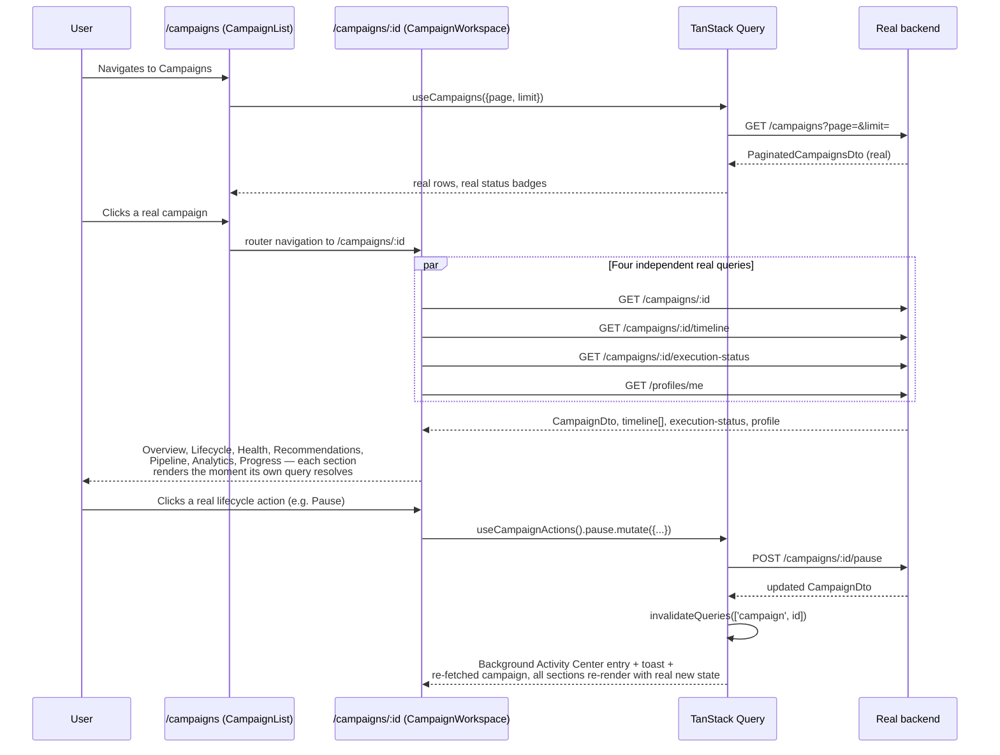

# 2. Workflow

## The real user path

## Why four independent queries, not one aggregate fetch

Each of `useCampaign`, `useCampaignTimeline`, `useCampaignExecutionStatus`, and `useMyProfile` is its own `useQuery` with its own loading/error state, rather than one combined fetch gating the whole page. This means a slow or failing `execution-status` call (the aggregate-counts endpoint, arguably the least critical of the four) never blocks the Overview or Lifecycle sections — which only need `campaign` and `timeline` — from rendering the instant their own data is ready. This is a direct, deliberate application of the platform's standing "every request has progress, independently" principle (`docs/interaction-framework/02-interaction-principles.md`), not a a default TanStack Query behavior that happened by accident.

## The action → refetch loop

Every lifecycle action's `onSuccess` calls `queryClient.invalidateQueries({queryKey: ['campaign', campaignId]})` and `invalidateQueries({queryKey: ['campaigns']})` (`features/campaigns/hooks/use-campaign-actions.ts`). This means the workspace and the list page always reflect the campaign's real, current server state after an action — never an optimistic guess about what the new state will be, consistent with `docs/frontend-architecture/07-state-management-strategy.md`'s "pessimistic mutations for lifecycle transitions" ADR, which this milestone is the first to actually exercise with real code.
