# 5. Component Hierarchy

```mermaid
graph TD
    ListPage["app/(dashboard)/campaigns/page.tsx"] --> CampaignList
    CampaignList --> ContextHeader1["shell/ContextHeader"]
    CampaignList --> CampaignListRow
    CampaignListRow --> UICard1["ui/Card, ui/Badge, ui/Button"]
    CampaignListRow --> MissionStatus0["lib/mission-status.getMissionStatus"]
    CampaignListRow --> UseCampaignActionsRow["hooks/use-campaign-actions (per row, Quick Start)"]

    DetailPage["app/(dashboard)/campaigns/[id]/page.tsx"] --> CampaignWorkspace
    CampaignWorkspace --> MissionStatusShared["lib/mission-status.getMissionStatus (computed once, M23.1)"]
    CampaignWorkspace --> ContextHeader2["shell/ContextHeader (real page &lt;h1&gt;)"]
    CampaignWorkspace --> CampaignOverview
    CampaignWorkspace --> CampaignActions
    CampaignWorkspace --> ExecutionStageList["shell/ExecutionStageList (reused from M22)"]
    CampaignWorkspace --> CampaignHealthCenter
    CampaignWorkspace --> SmartRecommendationPanel
    CampaignWorkspace --> TargetStatusBreakdown
    CampaignWorkspace --> OperationalAnalytics
    CampaignWorkspace --> CampaignProgressLog

    MissionStatusShared -.passed as prop.-> CampaignOverview
    MissionStatusShared -.passed as prop.-> CampaignHealthCenter
    CampaignOverview --> UICard2["ui/Card"]
    CampaignActions --> UIButton["ui/Button, ui/Input"]
    CampaignActions --> UseCampaignActions["hooks/use-campaign-actions"]
    CampaignHealthCenter --> TrustFeedbackCard["shell/TrustFeedbackCard (reused from M22.2)"]
    TargetStatusBreakdown --> UIBadge2["ui/Badge"]
    OperationalAnalytics --> StatTile["local StatTile"]

    CampaignWorkspace --> UseCampaign["hooks/use-campaign"]
    CampaignWorkspace --> UseCampaignTimeline["hooks/use-campaign-timeline"]
    CampaignWorkspace --> UseCampaignExecutionStatus["hooks/use-campaign-execution-status"]
    CampaignWorkspace --> UseMyProfile["features/profiles/hooks/use-my-profile"]
    AppShellGlobal["shell/AppShell → shell/GlobalHeader → shell/BackgroundActivityCenter (global, NOT re-instantiated per page)"]
    UseCampaignActions -.populates via useTrackedMutation.-> AppShellGlobal

    UseCampaign --> CampaignsApi["api/campaigns.api.ts"]
    UseCampaignTimeline --> CampaignsApi
    UseCampaignExecutionStatus --> CampaignsApi
    UseCampaignActions --> CampaignsApi
    UseCampaignActionsRow --> CampaignsApi
    UseMyProfile --> ProfilesApi["features/profiles/api/profiles.api.ts"]
    CampaignsApi --> ApiClient["lib/api-client.ts (unmodified)"]
    ProfilesApi --> ApiClient
```



## Milestone 23.1 integration changes

- **`CampaignListRow`** — extracted from `CampaignList`'s `.map()` (a real requirement, not a style choice: `useCampaignActions` is a hook, and hooks cannot be called inside a loop callback — it needs its own component). Adds Goal, Last Activity, and a real "Current Progress" field (`getMissionStatus()`'s label, zero extra cost) and a Quick Start action for `DRAFT`/`READY` campaigns, wired to the same real `useCampaignActions` mutation the workspace page uses. The row's Link (name) and its Quick Action Button are siblings, not nested, avoiding the interactive-in-interactive pattern already fixed elsewhere in this codebase.
- **`getMissionStatus()` de-duplication** — `CampaignWorkspace` now computes the descriptor once and passes it to both `CampaignOverview` and `CampaignHealthCenter` as a `missionStatus` prop, instead of each panel calling the pure function independently with identical inputs.
- **`CampaignActions`** now renders an explicit message ("This campaign is archived — no further actions are available") for the one real case where zero actions apply, instead of an unexplained empty row, and moves focus to the reason `<select>` when the Cancel confirmation form opens.

## Files created

```
packages/shared-types/src/dto/campaign.dto.ts
apps/web/src/features/campaigns/types/index.ts
apps/web/src/features/campaigns/api/campaigns.api.ts
apps/web/src/features/campaigns/hooks/use-campaign.ts
apps/web/src/features/campaigns/hooks/use-campaign-timeline.ts
apps/web/src/features/campaigns/hooks/use-campaign-execution-status.ts
apps/web/src/features/campaigns/hooks/use-campaigns.ts
apps/web/src/features/campaigns/hooks/use-campaign-actions.ts
apps/web/src/features/campaigns/components/campaign-overview.tsx
apps/web/src/features/campaigns/components/campaign-health-center.tsx
apps/web/src/features/campaigns/components/campaign-progress-log.tsx
apps/web/src/features/campaigns/components/target-status-breakdown.tsx
apps/web/src/features/campaigns/components/operational-analytics.tsx
apps/web/src/features/campaigns/components/smart-recommendation-panel.tsx
apps/web/src/features/campaigns/components/campaign-actions.tsx
apps/web/src/features/campaigns/components/campaign-list.tsx
apps/web/src/features/campaigns/components/campaign-workspace.tsx
apps/web/src/features/profiles/api/profiles.api.ts
apps/web/src/features/profiles/hooks/use-my-profile.ts
apps/web/src/lib/campaign-lifecycle-stages.ts
apps/web/src/app/(dashboard)/campaigns/[id]/page.tsx
docs/campaign-workspace/ (this document set)
```

## Files modified

```
packages/shared-types/src/dto/index.ts             — export campaign.dto
apps/web/src/lib/status-mappings.ts                  — + CAMPAIGN_TARGET_STATUS_TONE
apps/web/src/app/(dashboard)/campaigns/page.tsx        — real CampaignList replaces the M22.3 placeholder
```

No file inside `components/ui/`, `components/shell/`, `lib/hooks/use-tracked-mutation.ts`, `lib/stores/*`, `lib/api-client.ts`, or any M22/M22.2/M22.3 shell component was modified. This milestone's own constraint ("do not redesign existing infrastructure") is verifiable directly from this list.
