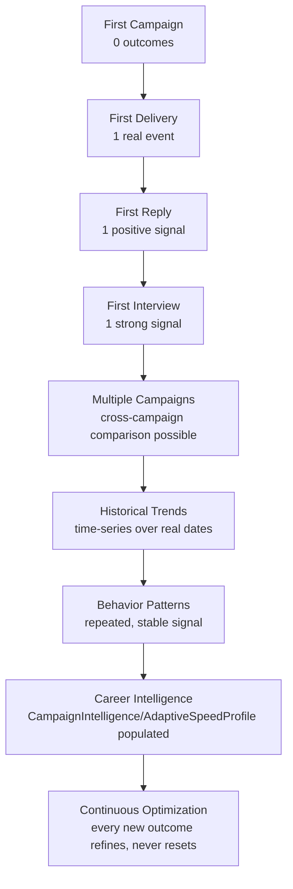

# 2. Career Knowledge Timeline

## How the platform becomes progressively more intelligent

Each stage below states the real, minimum evidence required before it's honest to claim that stage's capability — directly enforcing [Principle 9 (no simulated learning)](01-career-intelligence-principles.md). Nothing here is a UX sequence (that's [Product Experience's Emotional Journey](../product-experience/02-emotional-journey.md)); this is an *evidence-accumulation* sequence — what the platform is honestly entitled to say it knows, at each point.

### First Campaign — 0 outcomes
**What's knowable**: nothing about *this user's* outcomes yet. **What the platform can honestly say**: the campaign's configuration itself (goal, strategy, batch plan — all real, live per [M20](../frontend-architecture/03-screen-inventory.md)), and generic, evidence-based guidance sourced from the platform's own documented defaults, never personalized guidance framed as if it were. See [§5](05-career-recommendation-evolution.md) for exactly how "generic" guidance is worded honestly at this stage.

### First Delivery — 1 real event
**What's knowable**: the campaign pipeline produced one real, recorded `DELIVERED` transition. **What the platform can honestly say**: "your first application was delivered" (a fact, a [Delight Moment](../product-experience/13-delight-moments.md)) — not yet a rate, a pattern, or a prediction. One data point is a fact, not a trend.

### First Reply — 1 positive signal
**What's knowable**: one `COMPANY_REPLIED` transition exists. **CompanyMemoryEntry consequence**: this is the first point where `previousReplyAt` on that company's memory entry would become non-null, *if* the writer described in [§9](09-recommendation-memory.md) exists to record it — today, nothing does this automatically (§9's gap). **What the platform can honestly say**: acknowledge the specific event; still not a rate ("your reply rate" requires a denominator — see §3's minimum-sample rules).

### First Interview — 1 strong signal
**What's knowable**: one `INTERVIEW_SCHEDULED` transition. **CompanyMemoryEntry consequence**: `interviewCount` would increment for that company, again only once a real writer exists (§9). **What the platform can honestly say**: acknowledge it; this is the point where `CompanyMemoryEntry.historicalSuccessScore` first has a single real signal to eventually be derived from — still not enough for a *pattern* (§4's minimum-evidence thresholds).

### Multiple Campaigns — cross-campaign comparison becomes possible
**What's knowable**: comparing outcomes across ≥2 campaigns for the same user starts to be meaningful (did the second campaign's different strategy/batch-size produce a different reply rate than the first?). **What changes architecturally**: this is the first point [Personal Success Analytics (§3)](03-personal-success-analytics.md)'s per-campaign breakdown becomes genuinely comparative rather than just descriptive of one run.

### Historical Trends — time-series over real dates
**What's knowable**: with enough campaigns/applications spread over enough real time, direction-of-change becomes computable ("your reply rate this month vs. last month") — every timestamp involved is real (`ApplicationLifecycleStatus` transition dates, already captured in the timeline/history endpoints per [M20 §3](../frontend-architecture/03-screen-inventory.md)). **Guardrail**: a trend needs at least two real, sufficiently-populated windows to compare — one busy week compared to one empty week is not a trend, it's noise (§4, §6).

### Behavior Patterns — repeated, stable signal
**What's knowable**: a pattern (a specific city, industry, or timing factor correlating with better outcomes) becomes claimable only once it's been observed repeatedly and stayed stable across observations — this is [Pattern Detection's (§4)](04-pattern-detection-blueprint.md) whole discipline, and it is deliberately the *slowest* stage to reach, by design, because false patterns from small samples are the single most damaging thing this system could produce.

### Career Intelligence — the reserved hooks get genuinely populated
**What's knowable**: at this stage, and only at this stage, `CampaignIntelligence.bestSendTime`/`.bestBatchSize`/predictions and `AdaptiveSpeedProfile`'s ten factors can be computed from real, sufficient evidence and attached via the existing `recordIntelligenceAssessment()`/`recordAdaptiveSpeedAssessment()` hooks — with `decisionExplanation`/`recommendationExplanation` populated from the same real evidence, never left null while the numeric predictions are filled in (Principle 5, [§1](01-career-intelligence-principles.md)).

### Continuous Optimization
**What's knowable**: every subsequent real outcome refines the existing assessment rather than resetting it (Principle 4) — a new `CampaignIntelligence` attachment with a fresh `computedAt` supersedes the prior one for *current* guidance while the prior one's explanation remains inspectable as history (Principle 3, historical consistency) — see [§9's Recommendation Memory](09-recommendation-memory.md) for exactly how "what changed and why" is preserved.

## Why this timeline matters more than a feature list

A feature list says "we'll eventually show patterns." This timeline says *exactly what evidence threshold* separates "we can't say that yet" from "we can" — which is the difference between an architecture that can be implemented without guessing where the honesty line is, and one that has to be re-litigated ad hoc every time a new insight type is proposed later.
