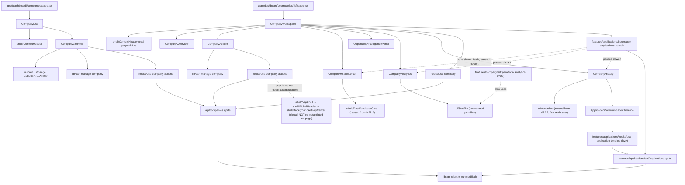

# 3. Component Hierarchy



## Files created

```
apps/web/src/features/companies/types/index.ts
apps/web/src/features/companies/api/companies.api.ts
apps/web/src/features/companies/hooks/use-companies.ts
apps/web/src/features/companies/hooks/use-company.ts
apps/web/src/features/companies/hooks/use-company-actions.ts
apps/web/src/features/companies/lib/can-manage-company.ts
apps/web/src/features/companies/components/company-list.tsx
apps/web/src/features/companies/components/company-overview.tsx
apps/web/src/features/companies/components/company-actions.tsx
apps/web/src/features/companies/components/company-health-center.tsx
apps/web/src/features/companies/components/opportunity-intelligence-panel.tsx
apps/web/src/features/companies/components/company-history.tsx
apps/web/src/features/companies/components/application-communication-timeline.tsx
apps/web/src/features/companies/components/company-analytics.tsx
apps/web/src/features/companies/components/company-workspace.tsx
apps/web/src/features/applications/hooks/use-applications-search.ts
apps/web/src/features/applications/hooks/use-application-timeline.ts
apps/web/src/components/ui/stat-tile.tsx
apps/web/src/app/(dashboard)/companies/[id]/page.tsx
docs/company-workspace/ (this document set)
```

## Files modified

```
packages/shared-types/src/dto/application.dto.ts    — corrected from an M1-era stub to the real ApplicationResponseDto shape
packages/shared-types/src/dto/company.dto.ts          — + PaginatedCompaniesDto
apps/web/src/features/applications/types/index.ts       — re-exports the corrected real shapes
apps/web/src/features/applications/api/applications.api.ts — searchApplications()/getApplicationTimeline() implemented for real
apps/web/src/lib/status-mappings.ts                        — + COMPANY_STATUS_TONE
apps/web/src/app/(dashboard)/companies/page.tsx              — real CompanyList replaces the M22.3 placeholder
apps/web/src/features/campaigns/components/operational-analytics.tsx — local StatTile replaced with the new shared ui/StatTile
```

## Files deleted

```
apps/web/src/features/applications/hooks/use-applications.ts   — orphaned M1-era stub, zero real callers anywhere
```

No file inside `components/shell/`, `lib/hooks/use-tracked-mutation.ts`, `lib/stores/*`, `lib/api-client.ts`, `lib/mission-status.ts`, or any prior milestone's Campaign Workspace component (other than the one-line `StatTile` extraction above) was modified. This milestone's own "do not redesign previous milestones" constraint is verifiable directly from this list.
