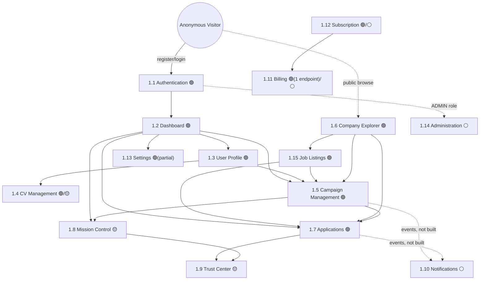

# 1. Information Architecture

## How to read this document

Every section below is a real area of the product. Each one states its **backend grounding** explicitly: whether it maps to live, wired API endpoints today; to a real backend module with no HTTP surface yet (dormant); or to no backend module at all (pure future scope). This isn't a formality — a frontend architecture that doesn't distinguish these three will get built against APIs that don't exist. See [docs/M19-VALIDATION-REPORT.md](../M19-VALIDATION-REPORT.md) §1.2 for the full 25-module inventory this is drawn from.

Three backend-grounding tiers are used throughout this whole document set:

- **🟢 Live** — a wired module (in `AppModule`) with real controllers today. Build against it now.
- **🟡 Dormant** — a real, tested backend module (domain + application layers exist, verified in M14–M19) with **no controller** — not reachable over HTTP yet. The architecture must be designed so wiring a controller later is additive, not a redesign.
- **⚪ Future** — no backend module exists at all. Purely product-architecture scope; backend work is a prerequisite, not assumed.

---

## Product areas

### 1.1 Authentication 🟢 Live

**Purpose**: get a visitor to an authenticated session, and keep that session valid.

**Responsibilities**: registration, login, token refresh, logout. Nothing else — no password reset, no email verification, no MFA exist in the backend today (see [13-risks-and-open-questions.md](13-risks-and-open-questions.md) OQ-1).

**Dependencies**: none upstream — this is the entry surface. Every other area depends on it (via the access token it produces).

**Connected backend modules**: `auth` (🟢). Endpoints: `POST /auth/register`, `POST /auth/login`, `POST /auth/refresh`, `POST /auth/logout`.

**Notable gap**: `register` returns tokens immediately — there is no email-verification step in the backend today, despite it being a natural, expected part of the flow. See [02-user-journeys.md](02-user-journeys.md) for how the frontend should represent this honestly.

### 1.2 Dashboard 🟢 Live (composed from several modules)

**Purpose**: the authenticated home base — a single screen that answers "what's happening with my job search right now" without navigating anywhere else.

**Responsibilities**: surface campaign health, recent application activity, and next actions. It does not own any data itself — it's a composition of summaries pulled from Campaigns and Applications.

**Dependencies**: Campaign Management, Applications (for widget data); Profile (for a completeness nudge).

**Connected backend modules**: `campaigns` (🟢, `GET /campaigns`, `GET /campaigns/:id/execution-status`, `GET /campaigns/:id/health`), `applications` (🟢, `GET /applications`). No dedicated "dashboard summary" endpoint exists — the dashboard composes existing list/detail endpoints client-side. See [04-dashboard-architecture.md](04-dashboard-architecture.md) for why that's the right call now and what a future aggregation endpoint would change.

### 1.3 User Profile 🟢 Live

**Purpose**: the candidate's professional identity — the data every campaign and application draws from.

**Responsibilities**: personal/professional details, skills, education, work experience, language proficiency, availability, salary expectation, CV, profile photo.

**Dependencies**: none upstream. Downstream: Campaign Management and Applications both read from it (a campaign can't meaningfully run against an incomplete profile — see the Recommendation Engine's `candidate-completeness` policy category, currently dormant but already modeling this exact concern).

**Connected backend modules**: `profiles` (🟢). Endpoints: `POST /profiles`, `GET /profiles/me`, `PATCH /profiles/me`, `POST /profiles/me/cv`, `POST /profiles/me/photo`.

**Notable gap**: the CV/photo endpoints accept **metadata only** (`fileName`, `fileUrl`, `mimeType`, `sizeBytes`) — there is no file-upload endpoint or object-storage integration in the backend today. The frontend needs an upload target (a presigned-URL flow against S3/R2/similar, or a dedicated upload endpoint) that doesn't exist yet. See OQ-2.

### 1.4 CV Management 🟢 Live (as metadata) / ⚪ Future (as file storage)

**Purpose**: a focused sub-area of Profile for managing the CV/resume specifically — separated out because it's the single most consequential artifact in the platform (the Application Assembly Engine's whole job is choosing which CV to attach).

**Responsibilities**: upload, preview, replace, and — once `application-assembly` (🟡) is wired — show which CV was selected for which application and why.

**Dependencies**: User Profile (CV metadata lives there). Downstream: Applications (CV selection is part of assembling an application package).

**Connected backend modules**: `profiles` (🟢, metadata only — same gap as 1.3); `application-assembly` (🟡, dormant — `CandidateApplicationAssemblyService` already produces a fully-explained CV/certificate selection decision, including *rejected* CVs and why, but nothing exposes this over HTTP yet). Design the screen to be ready for that explainability data (see [03-screen-inventory.md](03-screen-inventory.md) CV Management screen) without depending on it existing today.

### 1.5 Campaign Management 🟢 Live

**Purpose**: the core product loop — define a job-search campaign, run it, and watch it work.

**Responsibilities**: create/configure a campaign (goal, strategy, batch plan, execution window, rate limits), control its lifecycle (start/pause/resume/cancel/complete/retry/replay/archive), and inspect its state (timeline, health, execution status).

**Dependencies**: User Profile (a campaign runs on behalf of a complete profile). Downstream: everything execution-related.

**Connected backend modules**: `campaigns` (🟢) — the richest wired module in the platform, 16 endpoints covering the full 10-state lifecycle (`DRAFT → READY → RUNNING → {PAUSED, COOLING_DOWN, RESUMING} → {COMPLETED, STOPPED, CANCELLED} → ARCHIVED`). See [08-permission-matrix.md](08-permission-matrix.md) for exactly which actions are available from which state.

**Important boundary**: `campaigns` exposes the campaign *aggregate's own* state (its targets, its own health/timeline/execution-status) but has zero knowledge of the actual execution pipeline (`recommendations` → `decision-intelligence` → `execution-planning` → `execution-orchestrator` → `execution-runtime` → `worker`, all 🟡 dormant). A campaign's `execution-status` endpoint reflects what the Campaign aggregate itself tracks (batches, targets, goal progress) — not the moment-by-moment pipeline telemetry that `execution-tracking` (🟡) records. Those are two different, currently-disconnected pictures of "how is my campaign doing," and the UI must not conflate them. See 1.8 Mission Control below.

### 1.6 Company Explorer 🟢 Live

**Purpose**: browse and evaluate companies a campaign might target — the "who am I applying to" side of the product.

**Responsibilities**: search/filter companies, view a company profile (industry, size, location, trust score, hiring quality, visa sponsorship). Public read access (search/list/get are unguarded — a deliberate, correct design choice, see M19 report §5.1) so this doubles as a marketing/SEO surface for anonymous visitors.

**Dependencies**: none upstream. Downstream: Campaign Management (targets reference companies), Applications (an application is always against a company).

**Connected backend modules**: `companies` (🟢). Endpoints: `POST /companies`, `GET /companies/search`, `GET /companies`, `GET /companies/:id`, `PATCH /companies/:id`, `POST /companies/:id/archive`, `POST /companies/:id/restore`. Mutations are `EMPLOYER`/`ADMIN`-only; reads are public.

### 1.7 Applications 🟢 Live

**Purpose**: the ledger of every application a candidate has sent (or is preparing to send) — the most detailed state machine in the platform.

**Responsibilities**: track one application through its full 15-state lifecycle (`DRAFT → PREPARED → QUEUED → SENT → DELIVERED → OPENED → VIEWED → COMPANY_REPLIED → INTERVIEW_SCHEDULED → INTERVIEW_COMPLETED → OFFER_RECEIVED → CONTRACT_SIGNED`, with `REJECTED`/`WITHDRAWN`/`ARCHIVED` as exit lanes reachable from most states). Exposes both a structured timeline (`GET /applications/:id/timeline`) and a narrative history (`GET /applications/:id/history`) — two different read models over the same underlying transitions, deliberately.

**Dependencies**: User Profile (CV/snapshot at application time), Company Explorer (target), Campaign Management (an application can optionally reference the campaign that produced it via `campaignRef`).

**Connected backend modules**: `applications` (🟢) — 20 endpoints, the single largest controller in the platform. Every mutation requires a role (`CANDIDATE`, `EMPLOYER`, or `ADMIN`) matching who is realistically allowed to cause that transition — e.g. only `EMPLOYER`/`ADMIN` can register a company reply or schedule an interview; only `CANDIDATE`/`ADMIN` can sign a contract or withdraw. Delivery-tracking signals (`delivered`/`opened`/`viewed`) are `ADMIN`-only today because they're meant to originate from trusted server-side tracking, not a user's own browser — the frontend should never expose buttons for these three.

### 1.8 Mission Control 🟡 Dormant

**Purpose**: cross-campaign, cross-company operational visibility — "how is my whole job search doing," not one campaign at a time. This is the platform's most distinctive planned feature: 6 projections (Campaign Timeline, Germany Coverage, Regional Progress, Trust Center, Delivery Overview, Recommendation Insights) built and unit-tested against real `execution-tracking` data in M17–M18.

**Responsibilities**: aggregate execution events across every campaign into the 6 projections above, strictly read-only, with an explicit, honest disclosure policy for any metric that can't yet be computed from real data (established in M17 — see the projections' own `note`/`null` field convention).

**Dependencies**: `execution-tracking` (🟡, the real, Postgres-backed event store every projection reads from).

**Connected backend modules**: `mission-control` (🟡) — fully built, fully tested, **zero HTTP surface**. This is the single most consequential dormant module for this milestone: the entire Mission Control product area cannot be built today without first adding a controller. Design its screens fully (§3), but the readiness assessment in this document set must say plainly that Mission Control is blocked on backend work, not frontend work.

### 1.9 Trust Center 🟡 Dormant

**Purpose**: a focused, single-execution drill-down — "show me exactly what happened for this one send, in order, with every provider/company/geography detail." One of Mission Control's 6 projections, called out separately here because it's the natural target of a "view details" click from almost every other screen (an application row, a campaign timeline entry, a Mission Control delivery card).

**Responsibilities**: reconstruct one execution's full event chain via `(correlationId, traceId)` — never `traceId` alone (see M19 report §2.3 finding 3 — `TrustCenterProjectionService` currently has this exact bug, unfixed as of M19; the frontend must not surface it until that's corrected, or it will show cross-execution-contaminated data).

**Connected backend modules**: `mission-control` → `TrustCenterProjectionService` (🟡, dormant, plus the known bug above).

### 1.10 Notifications ⚪ Future

**Purpose**: tell the user something happened without them having to go look — a company replied, an interview was scheduled, a campaign paused itself, a subscription is about to expire.

**Responsibilities**: in-app notification feed, read/unread state, (eventually) email/push delivery preferences.

**Connected backend modules**: none. No notification module, table, or event-subscription mechanism exists anywhere in the backend. This is the one product area in this blueprint with **zero** backend grounding, dormant or otherwise — it is designed here purely as forward-looking architecture (see [03-screen-inventory.md](03-screen-inventory.md) and OQ-3). The natural implementation path is a new module subscribing to `ExecutionEvent`/application-transition/campaign-transition events, but building that is out of scope for this milestone and for the backend as it stands.

### 1.11 Billing 🟢 Live (barely) / ⚪ Future (almost entirely)

**Purpose**: subscription plan, payment method, invoice history, upgrade/downgrade.

**Responsibilities today**: read one subscription's status. That's the entire backend surface.

**Connected backend modules**: `billing` (🟢, technically — one controller, one endpoint: `GET /billing/subscriptions/:userId`). Everything else — plan selection, checkout, payment method management, invoices, upgrade/downgrade flows — has no backend endpoint. The domain layer has real entities (`Subscription`, `Plan`) and a `StripePaymentPort` (currently all methods `throw new Error('Not implemented')`, and — per M19 report §1.4 — that port is defined in the wrong layer and needs a small fix before real Stripe work starts). **Also**: the one live endpoint currently has no auth guard (M19 report §5.1, unfixed as of this milestone) — any unauthenticated caller can read any user's subscription by id. The frontend must not treat this endpoint as safe to call with a real `userId` until that's fixed; see OQ-4.

### 1.12 Subscription 🟢 Live (read-only) / ⚪ Future (management)

Kept distinct from Billing in the information architecture (Billing = payment/plan management, Subscription = the status/entitlement that gates feature access) because they answer different questions and gate different UI: Subscription status drives the Permission Matrix (§8); Billing is where you'd go to change it. Same backend grounding as 1.11.

### 1.13 Settings 🟢 Live (partial)

**Purpose**: account-level preferences distinct from the professional Profile — notification preferences (once 1.10 exists), password/security, session management, data export/deletion.

**Connected backend modules**: `users` (🟢, `GET /users/:id` only — no update endpoint exists yet for account-level fields distinct from the profile). `auth` (🟢, `logout` covers session termination; no "log out all sessions" or session-list endpoint exists). Most of Settings is ⚪ Future.

### 1.15 Job Listings 🟢 Live

**Not named in this milestone's example area list, but real and live** — worth stating plainly rather than silently folding into Company Explorer. `jobs` is a fully wired 9-endpoint module: `POST /jobs`, `GET /jobs/search`, `GET /jobs`, `GET /jobs/:id`, `PATCH /jobs/:id`, `POST /jobs/:id/publish`, `POST /jobs/:id/archive`, `POST /jobs/:id/close`, `POST /jobs/:id/reopen` — a 4-state lifecycle (`DRAFT → PUBLISHED → {ARCHIVED, CLOSED} → reopen`). Search/list/get are public (same pattern as Companies); mutations are `EMPLOYER`/`ADMIN`-only.

**Purpose**: the actual job postings that campaigns target and applications are sent against — every `Application` and every `CampaignTarget` references a `jobId`. Company Explorer shows *who*; Job Listings shows *what role, at that company*.

**Dependencies**: Company Explorer (every job belongs to a company). Downstream: Campaign Management (targets reference jobs), Applications (every application references a job).

**Connected backend modules**: `jobs` (🟢).

### 1.14 Administration ⚪ Future (future-ready)

**Purpose**: platform operator tooling — user/company management, moderation, platform-wide metrics.

**Connected backend modules**: none dedicated. `UserRole.ADMIN` exists and is already checked throughout every guarded controller (admins can act on any user's campaigns/applications/companies), but there is no admin-specific listing/dashboard endpoint (e.g. no "list all users," no platform-wide metrics endpoint). Architecture must reserve the surface (a `/admin` route group, gated on `UserRole.ADMIN`) without building it out — see [08-permission-matrix.md](08-permission-matrix.md) and [09-navigation-architecture.md](09-navigation-architecture.md).

---

## Information architecture map

## Cross-cutting ownership note

No product area owns another's data — every dependency arrow above is a *read* relationship (screen A displays data that screen B's module produced), never a shared-mutable-state relationship. This mirrors the backend's own one-hop-upstream-only dependency discipline (M19 report §1.1.4) and is the organizing principle behind [07-state-management-strategy.md](07-state-management-strategy.md): server state is owned by whichever backend module produced it and is never duplicated into a second area's local state.
