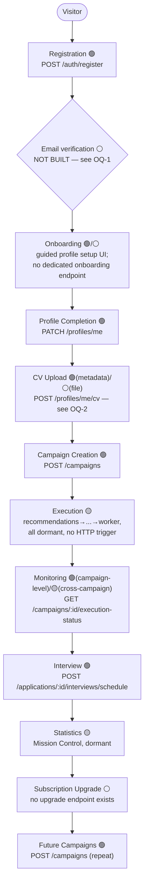
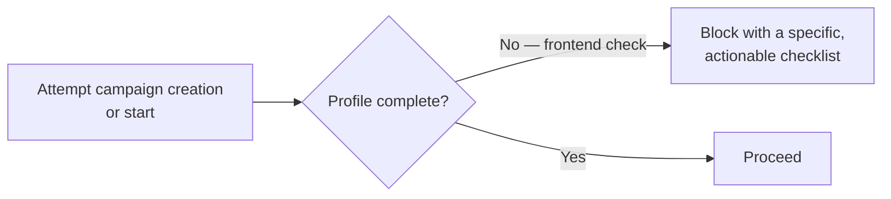

# 2. Complete User Journey

## Grounding note

Every step below is tagged 🟢/🟡/⚪ using the same tiers as [01-information-architecture.md](01-information-architecture.md). The **primary path** is written against what's live today wherever possible; where the milestone's own example journey names a step with no backend support, that's called out explicitly rather than silently assumed.

## Primary path

### Step-by-step

1. **Visitor** — lands on marketing/landing pages and the public Company Explorer (both unguarded — see 01 §1.6). No account required.
2. **Registration 🟢** — `POST /auth/register` with email + password, returns access + refresh tokens immediately. **There is no email-verification step in the backend.** The frontend should not build a "check your email" gate that blocks further use, because nothing would ever unblock it — see OQ-1 for the honest options.
3. **Onboarding 🟢/⚪** — a guided, multi-step UI wrapping the existing `POST /profiles` (create) and `PATCH /profiles/me` (fill in) calls. No dedicated "onboarding" backend concept exists — this is purely a frontend sequencing decision over real endpoints, which is the right way to build it (no backend risk).
4. **Profile Completion 🟢** — `PATCH /profiles/me`: skills, education, work experience, languages, availability, salary expectation.
5. **CV Upload 🟢(metadata)/⚪(file)** — `POST /profiles/me/cv` accepts metadata only. The actual file bytes need somewhere to go that doesn't exist in the backend yet (OQ-2). Design the screen against the metadata contract; treat the upload transport as a pluggable adapter (see [06-api-consumption-architecture.md](06-api-consumption-architecture.md)).
6. **Campaign Creation 🟢** — `POST /campaigns`: name, goal, strategy, batch plan, execution window, rate limit profile. Created in `DRAFT`.
7. **Execution 🟡** — starting a campaign (`POST /campaigns/:id/start`) is live and moves it to `RUNNING`, but nothing in the backend today actually *drives* the recommendation → decision → planning → orchestration → runtime → worker pipeline against a running campaign — every module in that chain is dormant with no scheduler wired to it (`scheduler`/`dispatcher` are also 🟡). A campaign can be `RUNNING` indefinitely with nothing happening. The frontend must represent "running" honestly (see [10-ux-principles.md](10-ux-principles.md) on avoiding implying activity the backend can't yet produce) rather than showing a live progress animation that has nothing behind it.
8. **Monitoring 🟢(campaign-level)/🟡(cross-campaign)** — `GET /campaigns/:id/execution-status`, `/health`, `/timeline` are live and reflect the Campaign aggregate's own state (targets, batches, goal progress). Cross-campaign Mission Control monitoring is 🟡 (no controller).
9. **Interview 🟢** — once a company replies (`POST /applications/:id/company-reply`, 🟢), interview scheduling/completion are both live application-lifecycle transitions.
10. **Statistics 🟡** — the natural home for this is Mission Control's projections; dormant.
11. **Subscription Upgrade ⚪** — no upgrade/checkout endpoint exists at all (01 §1.11).
12. **Future Campaigns 🟢** — creating another campaign is just repeating step 6; nothing in the backend limits campaign count today (a future subscription-tier quota would live in the dormant `business-policy-enforcement` module's `execution-quota` policy).

---

## Alternative paths

Each of these is one of the milestone's explicitly-requested edge journeys, grounded against what the backend actually does.

### Incomplete profile

**Backend reality**: `POST /campaigns` does **not** validate profile completeness server-side today (`candidate-completeness` is a policy category inside the dormant `business-policy-enforcement` module — not consulted by the live `campaigns` controller). This means **the frontend is currently the only enforcement point.** That's an acceptable, honest interim design (block the *button*, not rely on a server error), but it must be flagged as a known gap: a direct API call could create a campaign against an incomplete profile today. See OQ-5.

### Expired subscription

**Backend reality**: `SubscriptionStatus` has `PAST_DUE`/`CANCELED` values (01 §1.11), but no live endpoint gates any action based on subscription status — `campaigns`/`applications` controllers check role (`CANDIDATE`/`ADMIN`) and ownership, never subscription state. Design the Permission Matrix (§8) to show what access *should* look like once that gate exists, and mark every row honestly as "frontend-only today" where the backend doesn't yet enforce it.

### Failed campaign

`CampaignStatus.STOPPED` is a real, live, reachable terminal state, distinct from `CANCELLED` (user-initiated) and `COMPLETED` (goal reached). The domain distinguishes "the campaign stopped because something went wrong" from "the user cancelled it" — the frontend should surface that distinction, not collapse both into a generic "campaign ended" message. `POST /campaigns/:id/retry` is the live recovery action from a failed/stopped state (retries failed targets up to a configured max attempt count).

### Execution retry

Two genuinely distinct retry concepts exist and must not be conflated in the UI:
- **Campaign-level retry** 🟢 — `POST /campaigns/:id/retry` (`maxAttempts`) and `POST /campaigns/:id/replay` (`scope`, `targetIds` — never re-includes an already-dispatched target). Both live, both act on the Campaign aggregate.
- **Pipeline-level retry** 🟡/architectural — the M19 resilience validation (see [../M19-VALIDATION-REPORT.md](../M19-VALIDATION-REPORT.md) §2.6) proved the execution pipeline's own idempotency guard: retrying a *failed* task is allowed, retrying an *already-successful* one is blocked. This happens inside the dormant `worker` module and has no UI representation today because nothing calls it yet — but the guarantee it provides (a retry can never silently double-send) is exactly what a future "retry this execution" button can safely rely on once the pipeline is wired to a controller.

### Provider unavailable

Live today, deterministically: `NullEmailProvider` (the only registered email provider, M11) always reports itself unavailable, so any email-delivery attempt fails at the provider-selection boundary. This is a **known, permanent** state, not a transient one — until a real provider (Gmail/Microsoft Graph/SMTP) is registered, every send-path failure will read as "no provider available." The frontend must display this failure reason honestly and distinctly from other failure classes (validation error, network error, rate limit) — see [10-ux-principles.md](10-ux-principles.md) error-consistency rules — rather than presenting a generic "something went wrong."

### Validation errors

`ValidationPipe({ whitelist: true, transform: true })` is globally applied (M19 report, `main.ts`) — every DTO validation failure returns a structured 400 via `class-validator`, shaped by `AllExceptionsFilter` into `{ statusCode, timestamp, path, message }`, where `message` is either a string or (for validation errors) an array of per-field constraint messages. See [06-api-consumption-architecture.md](06-api-consumption-architecture.md) for the exact error-handling contract every screen must implement against this shape.

### Account suspension

**Backend reality**: no account-status/suspension field, endpoint, or concept exists anywhere in the `users` domain today (confirmed by direct inspection — the `User` entity carries no status beyond its password hash and identity). `UserRole.ADMIN` exists and can act on other users' resources, but there is no "suspend this account" action. This entire alternative path is ⚪ pure future scope — architected in the Permission Matrix (§8, a `SUSPENDED` row is reserved) and Navigation Architecture (§9, a "your account is suspended" interstitial route is reserved) but with nothing behind it. See OQ-6.

---

## Journey ownership summary

| Journey stage | Backend support | Frontend can build against it today? |
|---|---|---|
| Registration → Login | 🟢 Full | Yes |
| Email verification | ⚪ None | No — design must not assume it exists |
| Onboarding sequencing | 🟢 (via Profile) | Yes, as a frontend-only wrapper |
| Profile completion | 🟢 Full | Yes |
| CV upload (metadata) | 🟢 | Yes |
| CV upload (file transport) | ⚪ None | No — needs an upload adapter decision, OQ-2 |
| Campaign creation → lifecycle | 🟢 Full (16 endpoints) | Yes |
| Campaign execution (the pipeline actually running) | 🟡 Dormant, unwired | No — starting a campaign doesn't yet trigger anything |
| Company browsing | 🟢 Full, public | Yes |
| Application lifecycle | 🟢 Full (20 endpoints) | Yes |
| Cross-campaign monitoring / Mission Control | 🟡 Dormant | No — needs a controller first |
| Trust Center drill-down | 🟡 Dormant + known bug | No |
| Notifications | ⚪ None | No |
| Billing / subscription management | 🟢 (1 read endpoint, currently unguarded) / ⚪ (everything else) | Read-only status display only, and only once the auth-guard gap is fixed (M19 §5.1) |
| Administration | ⚪ None | No — reserve the route, build nothing |
| Account suspension | ⚪ None | No — reserve the state, build nothing |
