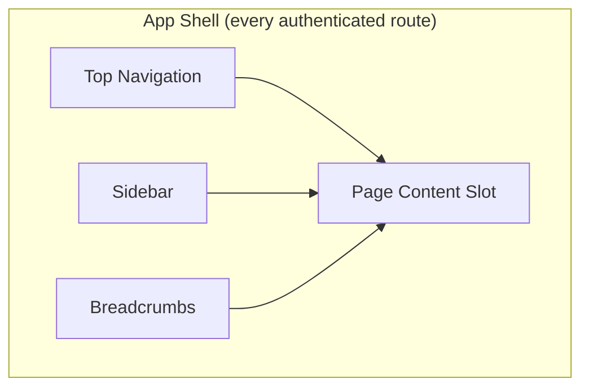
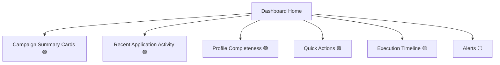

# 4. Dashboard Architecture

## Global layout

The shell is a Next.js route-group layout (`app/(dashboard)/layout.tsx` — already the scaffolded name, kept) wrapping every authenticated screen. It owns exactly three responsibilities: persistent navigation (Sidebar), identity/global-actions (Top Navigation), and location context (Breadcrumbs). It owns **no data fetching of its own** beyond the current user's identity (already in Auth State, §7) — every widget below fetches independently.

### Sidebar

**Responsibility**: primary navigation between product areas (01). Structure follows the Information Architecture directly — one entry per 🟢/🟡 area the current role can reach (permission-filtered per §8), 🟡 areas shown but visually marked "not yet connected" rather than hidden (honest about what's coming, per the milestone's own framing of Mission Control/Trust Center as real designed surfaces), ⚪ areas absent entirely (Notifications gets a bell in Top Nav instead, not a sidebar entry, until it's real).

**Behavior**: collapsible on desktop (icon-only rail), off-canvas drawer on mobile (reuses the Drawer component, §5). Active-route highlighting derived from the router, not local state.

### Top Navigation

**Responsibility**: global, location-independent actions — search (future, see [10-ux-principles.md](10-ux-principles.md)), notifications bell (⚪, reserved), user menu (profile shortcut, settings, logout).

**Does not** duplicate sidebar navigation or page-level actions (those belong to the page's own header, not the shell).

### Breadcrumbs

**Responsibility**: show where the current screen sits in the Information Architecture, derived automatically from the route tree (§9), never manually maintained per-page. For deep detail screens (e.g. `Campaigns → Campaign Detail → Timeline tab`), breadcrumbs show the hierarchy; tabs themselves are not breadcrumb segments (tabs are lateral, not hierarchical — see §9 nested-routing rules).

---

## Dashboard Home widget hierarchy

Every widget is an **independent fetch boundary**: its own loading/empty/success/failure state, its own error boundary, no widget's failure affects another's render (Screen Inventory §3 already states this as a requirement for Dashboard Home — this section is where that rule is defined once, for every widget everywhere it's reused).

### Campaign Summary Cards 🟢
**Responsibility**: at-a-glance status of the user's campaigns. **Data**: `GET /campaigns?ownerId=<self>` (or `/search` with a status filter for "active only"). **Reuse**: the same Card component (§5) used on the full Campaign List screen, just capped to N most-recently-updated. **Empty**: "Create your first campaign" CTA. This widget composes real data — it is not a distinct backend concept, just a capped, styled view of the same `GET /campaigns` the full list screen uses.

### Recent Application Activity 🟢
**Responsibility**: last N application status transitions across all the user's applications. **Data**: `GET /applications?candidateId=<self>` sorted client-side by last-updated (no dedicated "recent activity" endpoint exists — this is a composition, same honesty note as 01 §1.2). **Empty**: "No activity yet."

### Profile Completeness 🟢
**Responsibility**: a nudge, not a gate (the backend doesn't gate on this either — §2 "Incomplete profile"). **Data**: derived client-side from `GET /profiles/me`'s populated fields against a known-required field list maintained in the frontend (there is no server-side "completeness score" field). **Dismissible** once acknowledged, reappears if the profile regresses (e.g. CV removed) — completeness is computed fresh each render, never cached as a boolean flag.

### Quick Actions 🟢
**Responsibility**: role-appropriate shortcuts (Candidate: "New Campaign," "Complete Profile"; Employer: "Post a Job," "Add Company"). No new data — pure navigation, permission-filtered per §8.

### Execution Timeline 🟡
**Responsibility**: would show live, cross-campaign pipeline activity — the natural home for Mission Control's Campaign Timeline projection. **Data**: none — reserved widget slot, rendered as a "connect your execution pipeline" placeholder (matches the Mission Control screens' honesty treatment in §3), never a fake animated progress bar.

### Alerts ⚪
**Responsibility**: would surface urgent items (subscription expiring, campaign stopped, interview scheduled). **Data**: none — no notification/alert backend exists (01 §1.10). Reserved slot only.

---

## Component responsibility summary

| Component | Responsibility | Backend grounding |
|---|---|---|
| Sidebar | Cross-area navigation | N/A (routing) |
| Top Navigation | Global identity/actions | 🟢 (user identity from JWT) |
| Breadcrumbs | Location context | N/A (routing) |
| Campaign Summary Cards | Recent campaign status | 🟢 |
| Recent Application Activity | Recent lifecycle transitions | 🟢 |
| Profile Completeness | Frontend-computed nudge | 🟢 (source data), computation is frontend-only |
| Campaign Monitoring (Campaign Detail's Execution Status tab) | One campaign's real batch/target/goal state | 🟢 |
| Execution Timeline (dashboard widget) | Cross-campaign pipeline activity | 🟡 |
| Alerts | Urgent notifications | ⚪ |
| Recent Activity | Same as Application Activity above — one concept, not duplicated | 🟢 |
| Quick Actions | Role-based shortcuts | N/A (routing) |

No widget on this page ever fetches data another widget already fetched — see [07-state-management-strategy.md](07-state-management-strategy.md) for how the server-state cache (keyed by query, not by widget) makes this automatic rather than a discipline every widget author has to remember.
