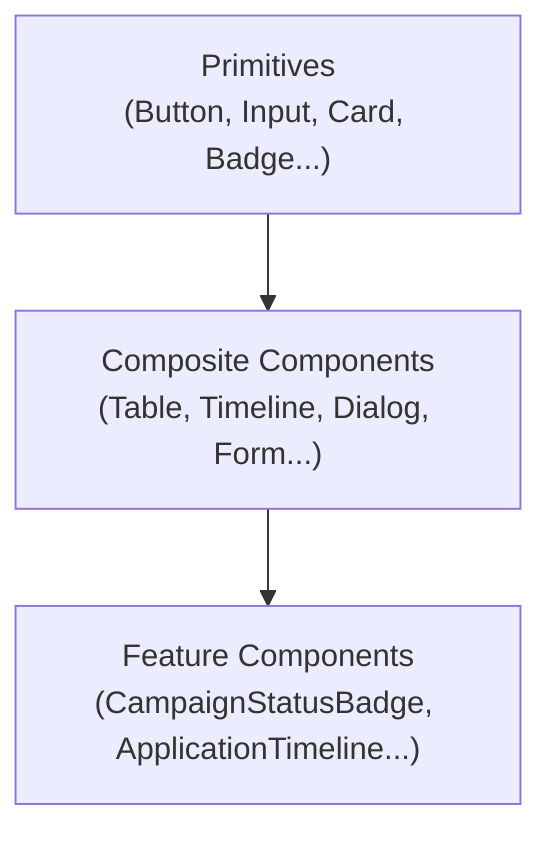

# 5. Component Architecture

No implementation code — this defines the contract (inputs, outputs, states, variants, accessibility, reuse strategy) each component must satisfy, so implementation can start directly from this document. Component names below are the ones later documents (03, 04, 06) already reference; treat this as the single source of truth for what those references mean.

## How components are organized

Three tiers, matching the `apps/web` scaffold's existing `components/ui/` vs. `features/*/components/` split (already established — `button.tsx`, `input.tsx`, `card.tsx` exist today) rather than inventing a new convention:

- **Primitives** (`components/ui/`) — no product knowledge, reusable in any Next.js app. Button, Input, Card already exist; this section extends that set.
- **Composite components** (`components/` or a new `components/composite/`) — combine primitives into product-agnostic patterns (a Data Grid, a Timeline) that still know nothing about Campaigns or Applications specifically.
- **Feature components** (`features/*/components/`) — product-aware (a `CampaignStatusBadge` knows about `CampaignStatus`; a generic `StatusBadge` composite does not). Feature components compose composites and primitives; they are never composed *by* a composite (one-directional, matching the backend's own upstream-only dependency discipline).

---

## Primitives

### Button
- **Inputs**: `variant` (`primary` | `secondary` | `ghost` | `destructive`), `size` (`sm` | `md` | `lg`), `disabled`, `loading`, `icon` (optional, leading/trailing), `children` (label).
- **Outputs**: `onClick`.
- **States**: default, hover, focus-visible, active, disabled, loading (spinner replaces icon/label area, button remains sized identically to prevent layout shift).
- **Variants**: `destructive` is reserved exclusively for irreversible actions (campaign cancel, application withdraw) — see [10-ux-principles.md](10-ux-principles.md) destructive-action rules; using it elsewhere is a design-system violation, not a style choice.
- **Accessibility**: native `<button>` semantics preserved; `loading` state sets `aria-busy`; icon-only buttons require an `aria-label`.
- **Reuse strategy**: every clickable action in the product is this component or a component built on it — no bespoke click handlers on divs/spans anywhere.

### Input / Textarea / Select
- **Inputs**: `label`, `value`, `onChange`, `error` (string, renders inline below the field), `helperText`, `required`, `disabled`.
- **States**: default, focus, error (red border + message + `aria-invalid`), disabled.
- **Accessibility**: label always programmatically associated (`for`/`id`), error announced via `aria-describedby`, never color-alone to indicate error state.
- **Reuse strategy**: the sole form-field primitive; every form in the product (Campaign Create, Profile Edit, Job Create...) is composed from these plus the Form composite below, never a one-off styled `<input>`.

### Card
- **Inputs**: `padding` (`sm`|`md`|`lg`), `interactive` (boolean — adds hover/focus affordance when the whole card is clickable, e.g. Campaign Summary Cards), `children`.
- **Accessibility**: `interactive` cards render as a single focusable/activatable unit (not a div with an onClick and no keyboard path).
- **Reuse strategy**: base container for every card-shaped surface — Campaign cards, Company cards, Job cards, Dashboard widgets all wrap Card rather than each defining their own box/shadow/radius.

### Status Badge
- **Inputs**: `label`, `tone` (`neutral`|`positive`|`warning`|`critical`|`info`), `size`.
- **Outputs**: none (display-only).
- **Variants**: tone is semantic, never chosen for decoration — see [11-design-system-foundation.md](11-design-system-foundation.md) on keeping semantic color separate from the brand accent.
- **Reuse strategy**: the generic primitive. Feature-layer wrappers (`CampaignStatusBadge`, `ApplicationStatusBadge`, `JobStatusBadge`, `SubscriptionStatusBadge`) each own a single status→tone mapping table for their domain's enum (e.g. `CampaignStatus.RUNNING → positive`, `STOPPED → critical`, `COOLING_DOWN → warning`) so the mapping lives in exactly one place per enum, not scattered across every screen that renders a status.

### Progress Components
- **Inputs**: `value` (0–100) or `indeterminate` (boolean, used only for genuine unknown-duration operations — see 06 loading-strategy note on never using indeterminate to mask a value the backend actually returns).
- **Variants**: linear bar (goal progress, upload progress), circular (compact widget contexts).
- **Accessibility**: `role="progressbar"` with `aria-valuenow`/`aria-valuemin`/`aria-valuemax`.

---

## Composite components

### Data Table / Data Grid
- **Inputs**: `columns` (key, label, render fn, sortable flag), `rows`, `loading`, `emptyState` (node), `onSort`, `pagination` (page, limit, total, onPageChange).
- **Outputs**: `onSort`, `onPageChange`, `onRowClick`.
- **States**: loading (skeleton rows matching column count), empty (renders the caller-supplied `emptyState` — never a hardcoded "no data," since every screen's empty state is meaningfully different, per 03), populated, error (caller-supplied retry action).
- **Accessibility**: semantic `<table>` markup (not div-grid) for real tabular data; sortable headers are buttons with `aria-sort`.
- **Reuse strategy**: backs every list screen — Campaign List, Company Explorer, Job Listings, Application List all configure this one component differently rather than each building their own table.

### Timeline
- **Inputs**: `entries` (timestamp, label, description, actor, tone), `orientation` (`vertical`|`horizontal`).
- **States**: loading (skeleton entries), empty ("no transitions yet" — a real, expected state for a fresh `DRAFT` resource, not an error), populated.
- **Reuse strategy**: the generic primitive behind Campaign Timeline (`GET /campaigns/:id/timeline`), Application Timeline (`GET /applications/:id/timeline`), and — once Mission Control is wired — the cross-campaign Execution Timeline. One component, three different `entries` sources; the component itself has zero knowledge of campaigns or applications.

### Dialog (modal)
- **Inputs**: `open`, `onClose`, `title`, `children`, `size` (`sm`|`md`|`lg`).
- **Behavior**: focus-trapped, `Escape` closes (unless a destructive confirmation is mid-submit — see 10), returns focus to the triggering element on close.
- **Reuse strategy**: every lifecycle-action confirmation (campaign cancel, application withdraw, company archive) is a Dialog composing a Form or a simple confirmation body — never a bespoke overlay implementation per screen.

### Drawer
- **Inputs**: `open`, `onClose`, `side` (`left`|`right`), `children`.
- **Reuse strategy**: mobile Sidebar (left), and any contextual detail panel that shouldn't leave the current page context (right) — e.g. a quick-view of a Trust Center execution without a full navigation away, once that's live.

### Form
- **Inputs**: `onSubmit`, `children` (Input/Select/etc. primitives), validation schema (client-side, mirrors but never replaces server-side `class-validator` rules — see 06).
- **Outputs**: `onSubmit(values)`, per-field error surfacing from a server error response (§6 error-shape contract).
- **States**: pristine, dirty (triggers the unsaved-changes navigation guard, §9), submitting (disables all fields + submit button), submit-error (field-level and/or form-level, per the `AllExceptionsFilter` response shape).
- **Reuse strategy**: every mutating screen (Campaign Create/Edit, Profile Edit, Job Create/Edit, Company Create/Edit, all Application lifecycle-action bodies) is a Form.

### Search / Filter Bar
- **Inputs**: `filters` (typed per screen — e.g. Job Listings' `employmentType`/`remotePolicy`/`germanLevel` vs. Company Explorer's `industry`/`size`), `onFilterChange`, `activeFilterChips`.
- **Reuse strategy**: one composite, configured per screen's real filter set (drawn directly from each `search` endpoint's actual query DTO — `SearchJobsQueryDto`, `SearchCompaniesQueryDto`, `SearchCampaignsQueryDto`, `SearchApplicationsQueryDto` — so the filter UI can never drift out of sync with what the backend actually accepts).

### Pagination
- **Inputs**: `page`, `limit`, `total`, `onPageChange`.
- **Reuse strategy**: every `search`/`list` endpoint in the platform returns the same `{ items, total }` paginated shape (confirmed across companies/jobs/campaigns/applications) — one Pagination component, one contract, everywhere.

### Notification Center panel ⚪
- **Inputs**: `items` (empty array today, always), `onMarkRead`.
- **Reuse strategy**: reserved composite, rendered by Top Navigation's bell icon; ships now as a permanently-empty, honestly-labeled panel (01 §1.10) so the UI slot exists and the eventual backend integration is additive, not a redesign.

---

## Feature components (representative, not exhaustive)

| Component | Domain knowledge | Composes |
|---|---|---|
| `CampaignStatusBadge` | `CampaignStatus` → tone mapping | Status Badge |
| `ApplicationStatusBadge` | `ApplicationLifecycleStatus` → tone mapping | Status Badge |
| `JobStatusBadge` | `JobStatus` → tone mapping | Status Badge |
| `SubscriptionStatusBadge` | `SubscriptionStatus` → tone mapping | Status Badge |
| `CampaignLifecycleActionBar` | status → available-actions matrix (§8) | Button, Dialog |
| `ApplicationLifecycleActionBar` | status + current user role → available-actions matrix (§8) | Button, Dialog |
| `CampaignCard` | goal-progress rendering from `CampaignResponseDto` | Card, Progress, Status Badge |
| `CompanyCard` / `JobCard` | domain field layout | Card |
| `CampaignTimeline` / `ApplicationTimeline` | maps domain timeline entries to generic `Timeline` props | Timeline |

Every feature component's job is narrow and singular: translate one real backend DTO/enum into generic composite/primitive props. None of them fetch data themselves (see [07-state-management-strategy.md](07-state-management-strategy.md) — data-fetching is a hook/query concern, rendering is a component concern, never mixed).

---

## Accessibility baseline (applies to every component above)

- Every interactive element reachable and operable by keyboard alone (see [10-ux-principles.md](10-ux-principles.md) keyboard-navigation rules).
- Focus-visible states are never suppressed for mouse users' sake.
- Color is never the sole signal (Status Badges pair tone with a text label, always).
- All async states (loading/error) are announced to assistive tech via `aria-live` regions at the composite level (Data Table, Form), not left to visual-only skeletons.
