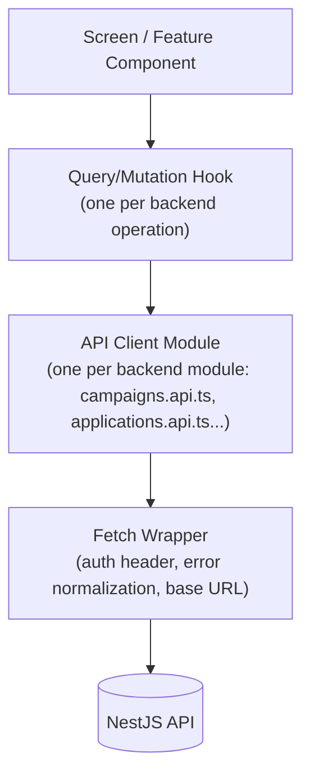

# 6. API Consumption Architecture

## The contract every screen is built against

Confirmed directly from the live backend (not assumed):

- **Base URL**: `NEXT_PUBLIC_API_URL` (already an env var in the scaffold's `.env.example`).
- **Auth**: Bearer JWT, `Authorization: Bearer <token>` header. Access token short-lived (`JWT_ACCESS_EXPIRES_IN`, default 15m), refresh token longer-lived (default 7d), via `POST /auth/refresh`.
- **Validation**: global `ValidationPipe({ whitelist: true, transform: true })` — unknown fields are stripped, not rejected; typed/coerced fields transform automatically (e.g. numeric query params).
- **Error shape**: global `AllExceptionsFilter` returns `{ statusCode, timestamp, path, message }` for every error, where `message` is a string (domain/business exceptions) or a string array (per-field `class-validator` messages). No stack traces or internals ever leak (confirmed, M19 report §5.3) — the frontend never has more error detail available than this shape provides, and should not build UI that assumes richer server-side error metadata exists.
- **Pagination**: every `search`/`list` endpoint returns `{ items: T[], total: number }`, driven by `page`/`limit` query params. This shape is consistent across all four paginated resources (companies, jobs, campaigns, applications) — confirmed by direct inspection of all four controllers.
- **Success responses**: no envelope — the DTO is returned directly (not wrapped in `{ data: ... }`). A `TransformInterceptor` exists in the backend (`common/interceptors/transform.interceptor.ts`) but does not change the shape observed from any controller read this milestone — verify this assumption against a live response before finalizing the fetch layer's response-unwrapping logic (see OQ-9).

## Layered client architecture

This is the scaffold's own existing shape (`features/*/api/*.api.ts`, `lib/api-client.ts`) — extended, not replaced. Every backend module gets one `*.api.ts` file exporting typed functions (one per endpoint), and every screen consumes those functions exclusively through a query/mutation hook layer — never calling `fetch` or an `*.api.ts` function directly from a component. This is the seam that makes the caching/retry/optimistic-update strategy below apply uniformly instead of being reimplemented per screen.

### Fetch wrapper responsibilities (extending `lib/api-client.ts`)

The current implementation (`apiClient<T>`) is a bare wrapper with a comment reserving exactly this work — extending it, not replacing its shape:

1. **Auth header injection** — reads the current access token from Auth State (§7).
2. **401 handling** — on a 401, attempt one silent `POST /auth/refresh`; on success, retry the original request once; on failure, clear Auth State and redirect to Login with a return-to param. This logic lives here exactly once, not per-hook.
3. **Error normalization** — parses the `{ statusCode, timestamp, path, message }` shape into a typed `ApiError` (distinguishing `message: string` from `message: string[]`) so hooks and forms never hand-parse raw response bodies.
4. **No retry-on-mutation by default** — see Retry Behavior below.

---

## Loading, caching, and retry strategy

**Loading strategy**: every screen shows a skeleton matching its eventual content's layout (never a bare spinner for content-shaped data — spinners are reserved for button/inline-action states, per [10-ux-principles.md](10-ux-principles.md)). Skeletons are driven by the query hook's `isLoading` state.

**Caching strategy**: server state is cached by query key = `[resource, params]` (e.g. `['campaigns', { ownerId }]`, `['campaign', id]`), with a default `staleTime` short enough that switching tabs/screens doesn't feel stale (target: 30s for list data, 0s — always revalidate — for anything mid-workflow like an in-progress lifecycle action) and refetch-on-window-focus enabled for anything that can change from another tab/session (campaign/application status, since another actor — an admin, an employer — can transition them). See [07-state-management-strategy.md](07-state-management-strategy.md) ADR for the specific library.

**Optimistic updates**: applied **only** to the small set of actions where the resulting state is fully predictable client-side and the cost of a rare rollback is low — e.g. marking a Dialog closed, a local filter change. **Not** applied to any lifecycle-transition mutation (campaign start/pause/cancel, application prepare/send/reject/etc.) — these mutate a guarded domain aggregate that can reject the transition for reasons the client can't fully predict (see 03's repeated point about domain-guard rejections needing to surface faithfully). Optimistic UI for a transition that then gets rejected server-side is worse than a one-second wait — it teaches the user to distrust the UI. Every lifecycle action shows a pending state and waits for the real response.

**Retry behavior**: reads (`GET`) retry automatically on network failure (not on 4xx) with exponential backoff, capped at 3 attempts. Writes (`POST`/`PATCH`) **never** auto-retry — an application `send` or a campaign `start` must not risk a duplicate side effect from a retried request (this is exactly the class of risk the backend's own M19 idempotency guard was built to catch at the pipeline layer, §2.6 of the validation report — the frontend should not casually reintroduce the same risk one layer up by auto-retrying mutations). A failed write surfaces its error and lets the user explicitly retry.

**Authorization requirements per call**: every authenticated endpoint requires the Bearer header (injected automatically, above); role requirements are enforced server-side (`@Roles()`) and must be **mirrored, not replaced**, client-side — the UI hides/disables actions the current role can't perform (per [08-permission-matrix.md](08-permission-matrix.md)), but the server's `RolesGuard` remains the actual authority. A hidden button is a UX courtesy, not a security boundary.

---

## Screen-to-endpoint map

This is the authoritative cross-reference between [03-screen-inventory.md](03-screen-inventory.md) and the real API surface. Full per-endpoint request/response shapes live in the generated Swagger contract (`GET /api/docs`, confirmed live in M19) — this table is the routing map between screens and operations, not a duplicate of the OpenAPI schema.

| Screen | Operation | Method + Path | Caching | Optimistic? |
|---|---|---|---|---|
| Login | Authenticate | `POST /auth/login` | N/A (mutation) | No |
| Register | Create account | `POST /auth/register` | N/A | No |
| (session) | Refresh | `POST /auth/refresh` | N/A, invoked by fetch wrapper | No |
| (session) | Logout | `POST /auth/logout` | Clears all caches on success | No |
| Profile Overview | Fetch own profile | `GET /profiles/me` | 30s staleTime | — |
| Profile Edit | Update profile | `PATCH /profiles/me` | Invalidates `['profile']` on success | No |
| CV Management | Register CV metadata | `POST /profiles/me/cv` | Invalidates `['profile']` | No |
| Company Explorer | Search companies | `GET /companies/search` | 30s, keyed by filter params | — |
| Company Detail | Fetch one | `GET /companies/:id` | 30s | — |
| Company Create/Edit | Mutate | `POST /companies`, `PATCH /companies/:id` | Invalidates `['companies']` list + `['company', id]` | No |
| Job Listings | Search jobs | `GET /jobs/search` | 30s, keyed by filters | — |
| Job Detail | Fetch one | `GET /jobs/:id` | 30s | — |
| Job Create/Edit/Publish | Mutate | `POST /jobs`, `PATCH /jobs/:id`, `POST /jobs/:id/publish` etc. | Invalidates `['jobs']` + `['job', id]` | No |
| Campaign List | List/search | `GET /campaigns`, `/search` | 30s, refetch-on-focus | — |
| Campaign Detail (Overview) | Fetch one | `GET /campaigns/:id` | 0s staleTime, refetch-on-focus (mid-workflow) | — |
| Campaign Detail (Timeline) | Fetch timeline | `GET /campaigns/:id/timeline` | 0s, refetch-on-focus | — |
| Campaign Detail (Health) | Fetch health | `GET /campaigns/:id/health` | 30s (changes rarely) | — |
| Campaign Detail (Execution Status) | Fetch status | `GET /campaigns/:id/execution-status` | 0s, poll every 15s while `RUNNING` (see note below) | — |
| Campaign Create | Create | `POST /campaigns` | Invalidates `['campaigns']` | No |
| Campaign lifecycle actions | Mutate | `PATCH`, `POST :id/{start,pause,resume,cancel,complete,retry,replay,archive}` | Invalidates `['campaign', id]` + `['campaigns']` list | No |
| Application List | List/search | `GET /applications`, `/search` | 30s, refetch-on-focus | — |
| Application Detail | Fetch one | `GET /applications/:id` | 0s, refetch-on-focus | — |
| Application Detail (Timeline/History) | Fetch | `GET /applications/:id/{timeline,history}` | 0s, refetch-on-focus | — |
| Application Create | Create | `POST /applications` | Invalidates `['applications']` | No |
| Application lifecycle actions | Mutate | `POST :id/{prepare,queue,send,company-reply,interviews/*,offer,contract,reject,withdraw,archive}` | Invalidates `['application', id]` + `['applications']` list | No |
| Subscription & Billing | Fetch status | `GET /billing/subscriptions/:userId` | 60s | — |

**Note on polling**: `GET /campaigns/:id/execution-status` polling while `RUNNING` is a deliberate, narrow exception to "no client-side simulation of real-time data" (03/04's repeated warning) — this endpoint reflects real, live Campaign-aggregate state (batches, targets, goal progress), so polling it is polling something real, not fabricating activity. This is different in kind from building a fake "live execution" animation with nothing behind it (§2 step 7's warning) — the distinction is real-data-polled vs. no-data-simulated, and every future engineer extending this pattern should preserve that distinction rather than genericizing it into "poll everything that feels live."

---

## Request/response shape ownership

Every DTO consumed by the frontend is typed from `@german-job-engine/shared-types` where a shared type already exists (`UserRole`, `CampaignStatus`, `ApplicationLifecycleStatus`, `JobStatus`, `SubscriptionStatus`, and the DTO interfaces under `packages/shared-types/src/dto/`) — this package is already a pnpm workspace dependency of `apps/web` (confirmed in `package.json`). Where the backend module's own response DTOs (e.g. `CampaignResponseDto`, `ApplicationResponseDto`, `CampaignExecutionStatusResponseDto`) aren't yet mirrored in `shared-types`, extending that package is the correct home for them — not hand-duplicating types inside `apps/web`. This is an explicit ADR (§12, ADR-004): one source of truth for cross-boundary types, matching the monorepo's existing intent for that package.
