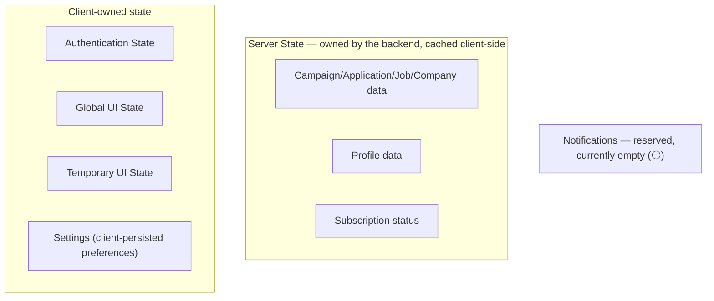

# 7. State Management Strategy

## Principle: every piece of state has exactly one owner

This mirrors the backend's own discipline (one aggregate owns its invariants; one repository owns persistence for its aggregate — M19 report §1.1). The frontend equivalent: no two state containers ever hold the same fact. A campaign's status lives in the Server State cache, full stop — it is never copied into a Zustand store "for convenience," because the moment it's copied, one of the two copies will eventually be stale and nobody will know which.

## The eight state categories

### Server State
**What**: every domain fact that originates from the API — campaigns, applications, jobs, companies, profile, subscription status. **Owner**: the backend; the frontend holds a *cache*, not a second source of truth. **Persistence**: none beyond the in-memory query cache — always refetched fresh on a new session, never persisted to `localStorage`, because stale domain data (a campaign shown as `RUNNING` after it was actually `STOPPED` by another session) is actively misleading, not just inconvenient. **Ownership boundary**: components never mutate this state directly — every write goes through a mutation hook that calls the real endpoint and then invalidates the affected cache keys (§6).

### Authentication State
**What**: access token, refresh token, current user identity (id, email, role) decoded from the JWT. **Owner**: the frontend session layer. **Persistence**: refresh token in an `httpOnly` cookie if the backend is extended to set one (it does not today — see OQ-10; currently tokens are returned in the response body only, meaning the frontend must choose a storage mechanism itself, and the ADR in §12 records that choice and its tradeoff). Access token held in memory only, never `localStorage` (XSS exposure — see [10-ux-principles.md](10-ux-principles.md) and the security posture noted in the M19 report). **Scope**: global, read by the fetch wrapper (§6) and by every permission check (§8).

### Campaign State
**Not a separate store.** Campaign data is Server State (above) — called out here only to be explicit that "Campaign State" in the milestone's own vocabulary maps onto the general Server State category, not a bespoke campaign-specific store. The only *client-only* campaign-adjacent state is the in-progress Campaign Create wizard's unsaved form values (Temporary UI State, below).

### Execution State
Same resolution as Campaign State: `GET /campaigns/:id/execution-status` is Server State, polled per §6's narrow, justified exception. There is no separate "execution state" concept beyond what that endpoint returns — inventing a richer client-side execution state than the backend actually tracks would be exactly the kind of fabricated activity §2/§4 repeatedly warn against.

### Notifications ⚪
**What**: would be an in-app feed. **Owner**: N/A — no backend module exists (01 §1.10). **Current implementation**: a permanently-empty reserved slot in Global UI State (the bell icon's open/closed state is real client UI state; its *contents* are not, because there's nothing to contain).

### Settings
**What**: client-persisted preferences — theme (light/dark, see [11-design-system-foundation.md](11-design-system-foundation.md)), sidebar collapsed/expanded, table page-size preference. **Owner**: frontend entirely — these are UI preferences with no backend counterpart and none is needed (contrast with Account Settings, 03, which *is* server state once its endpoints exist). **Persistence**: `localStorage`, safe because none of it is sensitive or a source of truth for domain data.

### Temporary UI State
**What**: in-progress form values, open/closed dialogs, active tab, selected table rows, current pagination page. **Owner**: local component state (or URL state for anything that should survive a refresh/be shareable — active tab, pagination page, active filters — see [09-navigation-architecture.md](09-navigation-architecture.md) on using the URL as the source of truth for exactly this category). **Persistence**: none beyond the URL, by design — a dialog that's open should close on refresh; a filter that's active should not (hence URL, not component state, for filters).

### Global UI State
**What**: sidebar collapsed state, active theme, toast/notification-panel open state, whether a global loading bar is showing. **Owner**: a single small global store (see ADR-002, §12) — deliberately minimal, since most "global-feeling" state above is actually better modeled as Server State, URL state, or per-feature local state once examined closely.

---

## Ownership table (explicit, per the milestone's request)

| State | Owner | Persisted? | Where |
|---|---|---|---|
| Campaign/Application/Job/Company/Profile/Subscription data | Backend (cache only, client-side) | No (session-only cache) | Server-state cache (§12 ADR-001) |
| Access token | Frontend session layer | No (memory only) | Auth module |
| Refresh token | Frontend session layer | Depends on ADR-003 (§12) | Auth module |
| Current user identity | Derived from JWT | No | Auth module |
| Execution status (polled) | Backend (cache only) | No | Server-state cache |
| Notifications | N/A — nothing to own yet | No | Reserved slot only |
| Theme, sidebar state, table page-size | Frontend preference | Yes, `localStorage` | Global UI store |
| In-progress form values | Component | No | Local component state |
| Active tab, filters, pagination page | URL | Yes (shareable link) | Route/query params |
| Dialog/drawer open state | Component (or Global UI store for app-wide ones like the notification panel) | No | Local or global UI store |

---

## Why this split, not a single global store

A single Redux-style store holding everything (server data included) was considered and rejected: it would require the frontend to reimplement cache invalidation, staleness, and refetch-on-focus by hand — problems a dedicated server-state library already solves correctly (see ADR-001, §12) — and it would make "who owns this fact" ambiguous exactly where the backend's own architecture goes out of its way to keep ownership unambiguous (one aggregate, one repository, per M19 report §1.1). Keeping server state and client state in structurally different systems makes the ownership question answer itself: if it came from `fetch`, it's server state; if it didn't, it isn't.
