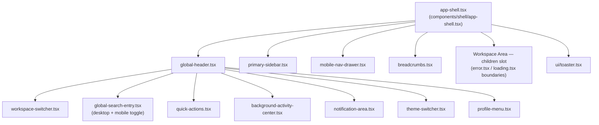

# 1. Application Shell

## This is real, working code — not a specification

Unlike every prior blueprint milestone, this document describes code that exists, builds, and has been run against the live backend at `apps/web/src/components/shell/`. Every claim below is checkable against a real file.

## Composition

Mounted once, at `app/(dashboard)/layout.tsx` — every route inside the `(dashboard)` route group inherits it automatically via Next.js's layout nesting; no screen imports or re-renders the shell itself, satisfying the milestone's "the shell must never be recreated" requirement structurally, not just by convention.

## Element by element

**Global Header** (`global-header.tsx`) — logo/home link, Workspace Switcher, Global Search Entry, and the identity/global-action cluster (Quick Actions, Background Activity Center, Notification Area, Theme Switcher, Profile Menu). Owns no page-level actions, per [M20's rule](../frontend-architecture/04-dashboard-architecture.md) that the header never duplicates sidebar or page content. On mobile, a search toggle button replaces the header with a full-width search row when active (Milestone 22.2 fix — the desktop-only `hidden md:flex` Global Search Entry had no mobile entry point at all in M22).

**Workspace Switcher** (`workspace-switcher.tsx`, Milestone 22.2) — honestly shows the single real workspace the authenticated user has today (their own name/email), rather than a fabricated multi-workspace picker. No backend concept of multiple workspaces per user exists, so this deliberately isn't built as a dropdown of options that don't exist.

**Theme Switcher** (`theme-switcher.tsx`, Milestone 22.2) — Light/Dark/System, backed by `lib/stores/theme-store.ts`. An inline pre-hydration boot script (`theme-boot-script.tsx`) reads the stored preference synchronously before paint, so there is no flash of the wrong theme; `theme-initializer.tsx` syncs the Zustand store to that already-applied value on mount without touching the DOM again.

**Context Header** (`context-header.tsx`, Milestone 22.2) — a generic `{ title, status?, actions? }` layout primitive for a future page's own header row (e.g. Campaign Workspace's title + Mission Status badge + action buttons). Not yet instantiated by any real page in this milestone (no such page exists), but ready for the next one.

**Primary Sidebar** (`primary-sidebar.tsx`) — reads `lib/navigation.ts`'s `NAV_ITEMS`, filtered by the real authenticated user's role (`visibleNavItems()`). Every item is a real route; dormant areas (Mission Control, Administration) render with a muted "Soon" badge rather than being hidden, per [M20's ADR-008](../frontend-architecture/12-architecture-decision-records.md) pattern, now implemented rather than just specified.

**Context Navigation** — not a separate component; realized as the Sidebar's `aria-current="page"` active-item highlighting, derived from `usePathname()` (the router), never local state — matches [M20 §4](../frontend-architecture/04-dashboard-architecture.md)'s exact requirement.

**Breadcrumbs** (`breadcrumbs.tsx`) — derived automatically from the URL path, never manually authored per screen. Route-param segments (ids) render as "Detail" rather than a raw UUID, since the breadcrumb has no name to show without a data fetch it deliberately doesn't perform.

**Workspace Area** — the `children` prop passed into `AppShell`; every future page's entire content lives here. This milestone does not build any real workspace content beyond a minimal placeholder (`app/(dashboard)/page.tsx`) — see [14-risks-and-future-expansion.md](14-risks-and-future-expansion.md) for why, and the constraint it's answering. `app/(dashboard)/error.tsx` and `app/(dashboard)/loading.tsx` (Milestone 22.2) give this slot real App Router error/loading boundaries — an uncaught render error inside any future page now shows a real recovery UI (extracted `ApiError` message + reset button) instead of a blank crashed screen, and a slow route transition shows a real `Skeleton`-based loading state instead of nothing.

`AppShell` also now gates the Workspace Area by role (Milestone 22.3): before rendering `children`, it looks up the current route's `NAV_ITEM` (`findNavItemForPath()`) and checks the authenticated user's role against it, rendering an honest "Access restricted" state instead when it doesn't match — closing a real gap where role restriction (e.g. `/admin`) was previously enforced only by the Sidebar hiding the link, not by anything stopping direct navigation to the URL. See [13, ADR-009](13-decision-records.md).

**Notification Area** (`notification-area.tsx`) — an honest, permanently empty panel. No notification backend module exists anywhere in the platform ([M20 §1.10](../frontend-architecture/01-information-architecture.md); [Product Experience §9](../product-experience/09-notification-strategy.md)) — this renders the exact copy that document set specifies rather than simulating notifications via polling.

**Profile Menu** (`profile-menu.tsx`) — real data only: `useAuth()` decodes the actual JWT (`sub`/`email`/`role` claims, verified against the backend's real `JwtPayload` interface) via `lib/stores/auth-store.ts`. Renders nothing if there's no real session.

**Global Search Entry** (`global-search-entry.tsx`) — real and functional, submitting to `/jobs?keyword=...`. No unified cross-resource search endpoint exists in the backend (confirmed by reading every controller — companies, jobs, campaigns, applications each have their own `search`) — this targets Jobs search specifically rather than inventing an API that doesn't exist, per this milestone's own "consume only existing backend contracts" constraint.

**Quick Actions** (`quick-actions.tsx`) — role-derived shortcuts (candidate: New Campaign; employer: Post a Job / Add a Company), pure navigation.

**Responsive Navigation** — `mobile-nav-drawer.tsx`, an off-canvas drawer below the `md` breakpoint (768px, [M20/M21's fixed breakpoint](../design-system/03-design-tokens.md)), toggled from the header's menu button, focus-trapped, closes on `Escape` or outside click.

## What "must never be recreated" means here, concretely

`AppShell` reads authentication state once, renders the header/sidebar/breadcrumbs once, and passes `children` through — a screen inside the Workspace Area re-rendering (a route navigation, a data refetch) never touches the shell's own component tree, because Next.js's App Router only re-renders the segment that changed. This is a structural guarantee from the framework, not a discipline the shell's own code has to enforce.

**Re-render discipline, corrected in Milestone 22.2**: `AppShell` originally destructured the entire `useAuthStore` (`useAuthStore()` with no selector), subscribing to every field including `accessToken` — which changes on every silent token refresh — and re-rendering the whole shell each time for no visible reason. It now uses four individual atomic selectors (`hydrate`, `hydrated`, `refreshToken`, `user`), so the shell only re-renders when one of those four specific values actually changes. `use-auth.ts` had the same bug and was fixed the same way.
