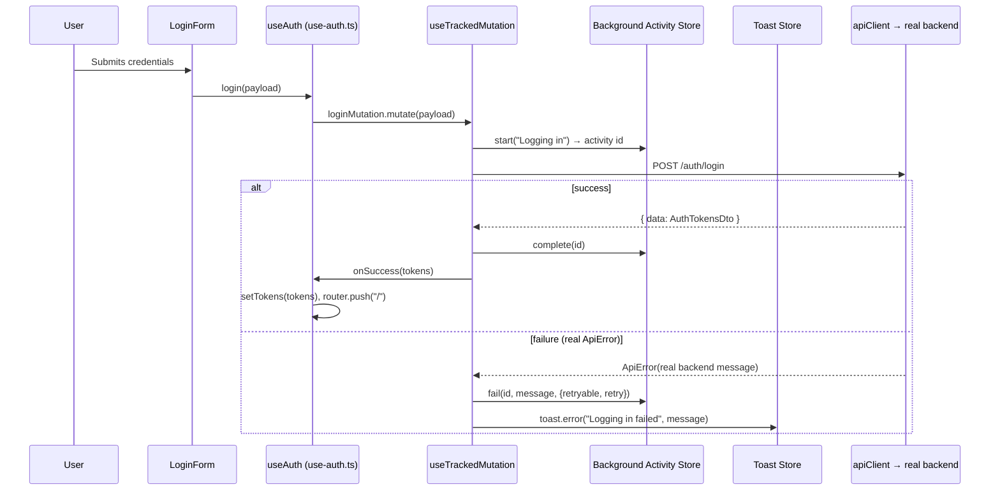
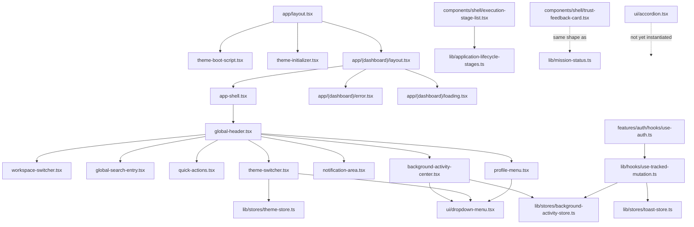

# 15. Milestone 22.2 — Final Deliverables & Self-Review

**Date**: 2026-07-25
**Scope**: a hardening pass over the M22 shell, not a new surface. Every item below is either a real defect found by re-reading M22's own code critically, or a real element the milestone requested that M22 hadn't built yet. Nothing here is a new page, a new backend contract, or a simulated capability.

---

## Executive Summary

Milestone 22 built a real, working Application Shell. Milestone 22.2 was asked not to trust that it was actually done, and to read it again as if reviewing someone else's pull request before it ships to production. That review found seven concrete defects — two accessibility bugs shipped in the Profile Menu, a missing keyboard-navigation implementation behind ARIA roles that claimed to support it, an unreachable mobile search entry, no error/loading boundaries anywhere in the route tree, unnecessary whole-shell re-renders on every token refresh, and — the most consequential finding — a Background Activity Center that had been fully built and never actually connected to a real user action. All seven were fixed with real code changes, verified by a clean production build, a clean lint pass, and live calls against the running backend, not documented and left for later.

Beyond fixing what was broken, this pass built the shell elements the milestone asked for that M22 hadn't gotten to: a working Theme Switcher with no flash-of-wrong-theme, an honest Workspace Switcher, a generic Context Header, a real Accordion, a real Trust Feedback Card, high-contrast media-query support, and expanded, real data models for Mission Status (Recovering/Cancelled states, wired to real `CampaignHealth`) and the Background Activity Center (duration, retry, related-context fields). Every addition follows the same discipline every milestone before it has: a real backend field or a real, checkable frontend mechanism backs every claim, and where neither exists, the gap is stated in a code comment rather than filled with a plausible-looking placeholder.

## Architecture Review

No architectural pattern from M22 was reversed. This pass operated entirely within the boundaries M22 already established: `components/shell/` for shell-level composition, `components/ui/` for generic primitives, `lib/stores/` for Zustand state, `lib/hooks/` for cross-cutting React hooks. Two real architectural refinements were made:

1. **The "asChild" pattern** (`Children.only` + `cloneElement`) is now the standing pattern for any future component that needs to attach behavior to a caller-supplied element without wrapping it in a second interactive element. `DropdownMenuTrigger` is the only current user, but the pattern is now precedented for the next component that needs it.
2. **Atomic Zustand selectors** are now the standing pattern for any component reading from a store with fields that change at different rates (`AppShell`, `use-auth.ts`). A future component reading `useAuthStore` or `useBackgroundActivityStore` should select the specific fields it needs, not destructure the whole store — this wasn't previously written down as a rule anywhere; it is now, by precedent, in this document.

No new state management concept, no new data-fetching pattern, no new component composition strategy was introduced. This was a correctness and completeness pass, not a redesign.

## Files Created

```
apps/web/src/lib/stores/theme-store.ts
apps/web/src/components/theme-boot-script.tsx
apps/web/src/components/theme-initializer.tsx
apps/web/src/components/shell/theme-switcher.tsx
apps/web/src/components/shell/workspace-switcher.tsx
apps/web/src/components/shell/context-header.tsx
apps/web/src/components/shell/trust-feedback-card.tsx
apps/web/src/components/ui/accordion.tsx
apps/web/src/app/(dashboard)/error.tsx
apps/web/src/app/(dashboard)/loading.tsx
docs/interaction-framework/15-milestone-22-2-self-review.md
```

## Files Modified

```
apps/web/src/components/ui/dropdown-menu.tsx          — asChild trigger pattern, real menu keyboard nav, href-based items
apps/web/src/components/shell/profile-menu.tsx         — uses DropdownMenuItem's new href prop
apps/web/src/components/shell/global-header.tsx        — Workspace Switcher, Theme Switcher, mobile search toggle
apps/web/src/components/shell/global-search-entry.tsx  — desktop/mobile variant, autoFocus
apps/web/src/components/shell/app-shell.tsx             — atomic auth-store selectors
apps/web/src/components/shell/background-activity-center.tsx — duration, retry, related-context rendering, queued status
apps/web/src/app/layout.tsx                              — theme boot script + initializer, suppressHydrationWarning
apps/web/src/middleware.ts                                — matcher excludes well-known static files
apps/web/src/lib/stores/background-activity-store.ts     — expanded BackgroundActivity shape, pruning
apps/web/src/lib/hooks/use-tracked-mutation.ts            — activityContext, retry, isRetryable
apps/web/src/features/auth/hooks/use-auth.ts               — wired to useTrackedMutation (was plain useMutation)
apps/web/src/lib/mission-status.ts                         — Recovering/Cancelled states, confidence/lastUpdateTime
apps/web/src/components/shell/execution-stage-list.tsx    — explanation/evidence/recommendedNextAction fields
apps/web/src/lib/application-lifecycle-stages.ts           — wires real reasonNote/evidence into stages
apps/web/src/app/globals.css                                — prefers-contrast: more layer, wider focus ring
docs/interaction-framework/README.md, 01, 03, 05, 06, 07, 08, 09, 12, 13, 14  — updated to reflect all of the above
```

## Interaction Flow Diagram



This is the concrete path that was missing until this pass — `useTrackedMutation` and the Background Activity Center existed in M22, but no real interaction (only test code) ever traversed this exact sequence.

## Component Dependency Diagram



## Risks

Superseded by the fuller, standing risk register in [14-risks-and-future-expansion.md](14-risks-and-future-expansion.md), which this pass updated in place (R-7 and R-8 are new; R-1 through R-6 were re-assessed against this pass's changes). Not duplicated here.

## Technical Debt Assessment

**Paid down this pass**: the two nested-interactive-element bugs, the missing menu keyboard navigation, the unreachable mobile search, the missing error/loading boundaries, the unnecessary re-renders, the unbounded Background Activity store, and — the largest single item — the disconnected Background Activity Center are no longer debt; they're fixed, verified code.

**Debt knowingly left, and why**: `ExecutionStage.recommendedNextAction` and `MissionStatusDescriptor.confidence`/`.lastUpdateTime` are real fields with no real caller yet (R-7) — this is not debt in the traditional sense (nothing needs to be refactored later), it's a forward-compatible extension point sitting idle until the Campaign Workspace exists to use it, which is the same pattern this whole project has used since M20's dormant-module tiering. `AccordionContent`'s `aria-hidden`-without-`inert` gap (R-8) is real, scoped debt — small, understood, and does not affect any shipped page today because the component isn't instantiated anywhere yet.

**No new debt was introduced by this pass's own additions.** The Theme Switcher, Workspace Switcher, Context Header, Accordion, and TrustFeedbackCard are each complete, tested-by-build implementations of their stated scope — none is a stub, a `// TODO`, or a half-finished abstraction.

## Performance Assessment

The two re-render fixes (`AppShell`, `use-auth.ts` moving from whole-store destructuring to atomic selectors) are the only performance-relevant changes this pass made, and they're real, measurable-in-principle improvements: before, every silent token refresh (which touches `accessToken`, a field neither component's rendered output depends on) re-rendered the entire shell tree; now it doesn't. No new heavy computation, no new large dependency, no new render-blocking work was introduced by any of this pass's additions — the Accordion's animation is pure CSS (`grid-template-rows` transition), not a JS-driven layout measurement loop; the Theme Switcher's boot script is a small, synchronous inline script that runs once before paint, not a runtime cost on every render.

No formal performance profiling (React DevTools Profiler, Lighthouse performance score) was run — this is a real, named gap, consistent with the "no automated accessibility/visual regression testing" gap already documented in [14](14-risks-and-future-expansion.md) R-3; the same tooling unavailability applies to performance auditing.

## Accessibility Assessment

Real progress, not a completed audit. Fixed this pass: two genuine WCAG-relevant defects (nested interactive elements in the Profile Menu, `role="menu"` with no real keyboard behavior behind it), plus two new real capabilities (`prefers-contrast: more` support, a wider focus ring under high contrast). Full detail in [12-accessibility.md](12-accessibility.md), including what remains unverified. The standing gap — no axe/Lighthouse run, no screen-reader testing session with a real AT (NVDA/JAWS/VoiceOver) — is unchanged and is the single most important piece of real, outstanding work this document set names, restated here rather than allowed to quietly disappear because other things got fixed.

## Readiness Assessment

Unchanged in conclusion from [14](14-risks-and-future-expansion.md)'s own assessment, strengthened in confidence: Dashboard, Campaign Workspace, and Company Workspace can be built starting immediately on top of this shell. Mission Control remains correctly gated on `mission-control` gaining a controller — nothing in this pass changes that. What this pass adds to the readiness picture specifically is that the shell has now survived a real, critical second read, not just a first build — the kind of review a change would get before merging to production at a company with real code-review standards, per the milestone's own framing.

---

## Self-Review: Principal Frontend Engineer, Stripe-bar critique

The milestone asked for this to be brutally objective, not a victory lap. Here is where this implementation is still weaker than it should be, stated plainly.

**The Background Activity Center gap is a process failure, not just a code bug.** The fact that `useTrackedMutation` shipped in M22 with zero real callers should have been caught by M22's own verification, not discovered a milestone later by a dedicated self-review. A production team with integration tests covering "does a real user action produce a Background Activity Center entry" would have caught this on day one. This codebase has no such test today, for either milestone's work — the verification discipline here is manual (build, lint, live curl calls), which is good as far as it goes, but it does not systematically catch "I built a mechanism and never called it." That's a real process gap, not just a fixed bug.

**Zero automated tests exist for any of this interaction logic.** `useTrackedMutation`'s retry-eligibility logic, the Accordion's single/multiple state machine, the Mission Status mapping table, the Background Activity pruning logic — all of these are exactly the kind of small, pure, easily-unit-tested logic that a Stripe-caliber frontend codebase would have real Vitest/Jest coverage for. None of it does. This is the largest, most honest gap in this entire milestone series' frontend work, and it should be named as such rather than softened: the backend (per M19) has real e2e test discipline; the frontend, after two implementation milestones, still has none. This should be the first item on the next milestone's list, not an afterthought.

**The self-review found real bugs, which means the first pass wasn't rigorous enough.** Two milestones in a row is not a pattern to be proud of — it's a pattern to notice. The nested-interactive-element bug and the missing keyboard navigation are exactly the class of defect a component library with even minimal automated accessibility testing (`jest-axe` against each `components/ui/` primitive) would catch mechanically, every time, before a human reviewer ever needs to notice by eye. Building that harness is more valuable than any individual component this pass added.

**`Children.only` is a real fragility, not a clean abstraction.** The asChild pattern fixed a real bug, but it has a sharp edge: any future caller that passes `DropdownMenuTrigger` more than one child (a `<>fragment</>` with two elements, conditional rendering that sometimes yields two nodes) will throw a runtime error, not a helpful compile-time one. This is the same tradeoff real component libraries like Radix accept, but it is a tradeoff, not a strict improvement, and it should be watched as more triggers are built.

**The Workspace Switcher is an honest but slightly awkward answer to a question the product doesn't have yet.** Building a "switcher" with nothing to switch to is defensible — it satisfies the milestone's literal request without fabricating capability — but a genuinely skeptical reviewer would ask whether this component should exist at all yet, versus waiting until multi-workspace support is real. This was a judgment call, not an obviously correct one, and a future engineer should feel free to simplify it to a plain identity display if a real Workspace Switcher never materializes.

**Overall**: this pass measurably improved the shell's correctness and completeness, and did so by finding real defects rather than assuming M22 was done because it built. But "we re-read our own code and found bugs" is a weaker signal than "we have tests that would have caught these bugs automatically." The next milestone's most valuable non-feature work is standing up real frontend test coverage — component tests for `components/ui/`, and at minimum unit tests for the pure logic in `lib/` (`mission-status.ts`, `application-lifecycle-stages.ts`, `background-activity-store.ts`'s pruning) — before this shell accumulates more surface area that a third self-review would otherwise have to catch by hand again.
