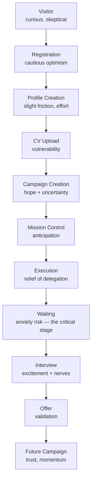

# 2. Emotional Journey

Each stage maps to a real point in [M20's user journey](../frontend-architecture/02-user-journeys.md) and screen inventory — this document adds the emotional layer on top, it doesn't re-derive the flow.

For each stage: expected emotion, possible frustration, platform response, confidence-building mechanism.

---

### Visitor
**Expected emotion**: curious, mildly skeptical — job-search tools have burned people before (spam, fake listings, ghosted applications).
**Possible frustration**: "another job board" fatigue; not believing the automation claim.
**Platform response**: lead with specifics, not superlatives — real company data (Company Explorer, 🟢 per M20 §1.6), real filters (Ausbildung, visa sponsorship, German level), not marketing adjectives.
**Confidence-building mechanism**: letting the visitor *see* real companies and real jobs before asking for anything — proof before commitment, matching the "evidence before conclusions" principle (§15).

### Registration
**Expected emotion**: cautious optimism — a small, hopeful commitment.
**Possible frustration**: any friction here reads as disproportionate to the ask (this is a 2-field form, per M20 §3 — `POST /auth/register`). An implied "verify your email" step that then goes nowhere (M20 flags this real gap, OQ-1) would be actively frustration-generating — never build a UI moment that promises a step the backend can't deliver.
**Platform response**: fast, minimal, no unnecessary questions front-loaded — save the depth for Profile Creation, where the user has already committed.
**Confidence-building mechanism**: immediate, working access — no dead-end wait state.

### Profile Creation
**Expected emotion**: mild effort-fatigue — this is real work (skills, education, experience, languages).
**Possible frustration**: feeling like filling out a form for a bureaucracy, not building something for themselves.
**Platform response**: frame every field by its payoff — "this helps us match you with roles that need German level B2+," not just a bare label. Progress shown honestly (§5) — this is real, stored data (`PATCH /profiles/me`, 🟢), so showing completeness building up is showing something true.
**Confidence-building mechanism**: visible completeness (§5) that moves every time the user provides something real — the platform is visibly *becoming more capable on their behalf* as they type, not just filling a form.

### CV Upload
**Expected emotion**: vulnerability — a CV is personal, and uploading it to an automated system that will send it out on your behalf is a real trust step, psychologically bigger than the previous ones.
**Possible frustration**: not knowing what happens to it, fear of it being sent somewhere wrong.
**Platform response**: state plainly what happens next (it becomes the basis for every future application; the platform doesn't send anything without the campaign/application steps the user controls) — never vague reassurance, actual mechanics in plain language.
**Confidence-building mechanism**: an explicit confirmation of what was received (filename, size — real metadata per M20 §3) and, once [application-assembly](../frontend-architecture/01-information-architecture.md) is live, why it was or wasn't selected for a given application (§7) — this is the exact moment the platform's honesty about explainability starts to matter emotionally, not just architecturally.

### Campaign Creation
**Expected emotion**: hope mixed with uncertainty — "will this actually work for me?"
**Possible frustration**: overwhelm at the configuration surface (goal, strategy, batch plan, execution window, rate limits — a real, rich form per M20 §3); fear of "getting it wrong."
**Platform response**: sensible defaults, explained in plain language at the point of choice, not a wall of unexplained fields. Every option ties to a real consequence the platform will actually honor (this is not decorative configuration — `SmartBatchPlan`, `ExecutionWindow`, `RateLimitProfile` are real domain concepts the backend enforces).
**Confidence-building mechanism**: a preview of what the campaign will actually do before committing — "this will target roughly N companies per week within your chosen hours" — grounded in the real config, not a generic "you're all set!"

### Mission Control
**Expected emotion**: anticipation — this is the moment the platform is supposed to feel like it's "on the case."
**Possible frustration**: **this is the single highest-risk stage in the entire journey today**, because [Mission Control is 🟡 dormant](../frontend-architecture/01-information-architecture.md) — no backend controller exists. If this screen is built to *look* alive before it's connected, the resulting frustration (a dashboard of nothing, or worse, fabricated-looking numbers) would undo trust built in every prior stage.
**Platform response**: exactly M20's honesty pattern (ADR-008) — a plainly-labeled "not connected yet" state, never a fake animation. See §4 (Transparency Principles) for the exact wording rules.
**Confidence-building mechanism**: honesty itself. A platform that says "this feature isn't live yet" is more trustworthy in that moment than one that fakes it — and that trust transfers to every other claim the platform makes elsewhere.

### Execution
**Expected emotion**: relief of delegation — "I don't have to keep doing this manually."
**Possible frustration**: not knowing if it's actually working, especially since — as M20 documents plainly — starting a campaign today doesn't yet trigger the dormant execution pipeline. **The platform must not claim delegation it can't yet perform.**
**Platform response**: report the real, live state (`GET /campaigns/:id/execution-status`, 🟢 — batches, targets, goal progress on the Campaign aggregate itself) honestly, and if the deeper pipeline isn't driving anything yet, that's a real limitation to disclose (§4), not paper over with a spinner.
**Confidence-building mechanism**: the aggregate-level state that *is* real (targets added, campaign `RUNNING`) shown with specificity — specificity is what makes delegation feel real, even at a stage where the full pipeline isn't wired yet.

### Waiting
**Expected emotion**: this is the emotional low point of the whole journey by nature (not a platform failure — job searching genuinely involves waiting) — anxiety, self-doubt, "is anything happening?"
**Possible frustration**: silence read as abandonment; checking obsessively for updates that aren't there.
**Platform response**: this is where Progress Psychology (§5) does its most important work — reframing "nothing has happened" (no reply yet) into "here's what *has* happened" (applications delivered, companies analyzed, N days into the campaign window) so waiting doesn't feel like a void.
**Confidence-building mechanism**: a calm, factual status ("your last application was sent 2 days ago; average reply time in similar campaigns is..." — only stated once real historical data supports the claim, never invented) plus a clear next scheduled action, so waiting feels like a phase with a shape, not an open-ended gap.

### Interview
**Expected emotion**: excitement plus real nerves — the stakes just became personal and immediate.
**Possible frustration**: the platform being too clinical at the one moment that's emotionally the biggest so far.
**Platform response**: a slightly warmer register than the platform's baseline calm (still professional — never gushing), acknowledging the moment specifically ("An interview has been scheduled with [Company]") rather than treating it as just another status badge update.
**Confidence-building mechanism**: this is a Delight Moment (§13) — the one place a small amount of restrained celebration is not just permitted but expected.

### Offer
**Expected emotion**: validation — the whole system's premise just proved itself.
**Possible frustration**: none typical; the risk here is the platform *undercelebrating* a genuinely major life moment out of over-applied restraint.
**Platform response**: the biggest (still professional) acknowledgment in the product. See §13.
**Confidence-building mechanism**: the moment itself is the confidence-builder — the platform's job is to not get in its way with excess process or a flat, statusbar-style confirmation.

### Future Campaign
**Expected emotion**: trust and momentum — "I know how this works now, and it worked."
**Possible frustration**: friction returning for a second campaign after the platform proved itself once (any regression to first-campaign-level hand-holding reads as the platform not remembering the relationship).
**Platform response**: streamlined creation informed by what's known (goal history, past strategy choice) wherever the backend genuinely supports carrying that forward — and if it doesn't yet, treat it plainly as a repeat of the same real flow rather than implying memory that isn't there.
**Confidence-building mechanism**: the campaign history itself (§6, Achievement History) — proof of a track record, not just a promise.
