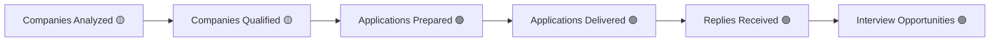

# 5. Progress Psychology

## The principle

A static number ("3 applications") tells the user a fact. A meaningful progress narrative ("12 companies analyzed → 3 qualified → 3 applications prepared → 2 delivered → 1 reply") tells them a *story with momentum* — the same underlying data, structured to show movement through a funnel instead of a single flat count. This document defines that funnel and, critically, marks exactly which stages of it are backed by real data today and which aren't — a progress narrative that includes a fabricated stage is worse than no narrative at all, per [Trust Architecture](03-trust-architecture.md).

## The funnel, and its real backend grounding

| Stage | Meaning | Real backend source | Status |
|---|---|---|---|
| Companies Analyzed | How many companies the Recommendation Engine evaluated for this candidate | `RecommendationContext.companyProfiles` size, inside `recommendations` module | 🟡 Dormant |
| Companies Qualified | How many companies produced an actual recommendation worth acting on | `Recommendation[]` count from `generateRecommendationsByCampaign()` | 🟡 Dormant |
| Applications Prepared | Applications that reached `PREPARED` in the real 15-state lifecycle | `GET /applications/search?status=PREPARED` | 🟢 Live |
| Applications Delivered | Applications that reached `DELIVERED` | `GET /applications/search?status=DELIVERED` | 🟢 Live |
| Replies Received | Applications that reached `COMPANY_REPLIED` | `GET /applications/search?status=COMPANY_REPLIED` | 🟢 Live |
| Interview Opportunities | Applications that reached `INTERVIEW_SCHEDULED` | `GET /applications/search?status=INTERVIEW_SCHEDULED` | 🟢 Live |

**Direct consequence for implementation**: the *back half* of this funnel (Prepared → Delivered → Replies → Interviews) is fully buildable today — it's a real, countable aggregation over the live Applications API ([M20 §6](../frontend-architecture/06-api-consumption-architecture.md)). The *front half* (Analyzed → Qualified) is not available until `recommendations` gets a controller. Do not fabricate front-half numbers to complete the visual funnel — show the funnel starting from whichever stage is real, or show the front half in the same honest "not connected yet" state as Mission Control ([§4](04-transparency-principles.md)), never with an invented placeholder number.

## Regional Coverage and Mission Progress

- **Regional coverage** — the Germany Coverage Map is a Mission Control projection, 🟡 dormant, and per [M19's validation](../M19-VALIDATION-REPORT.md) explicitly bound by a "never estimate location" rule (geography must come only from verified company records). This is a progress metric that must **never** be shown with interpolated or estimated regional fill — when it's live, it shows exactly the regions with verified activity and nothing else, even if that makes the map look sparse early on. A sparse, honest map is correct progress psychology; a smoothed, estimated one is a fabrication no matter how much better it looks.
- **Mission progress** — the closest real equivalent today is a campaign's own goal progress: `targetApplicationCount` (the goal) against actual applications sent, available via `GET /campaigns/:id/execution-status` (🟢). This is genuinely a "mission" in miniature — one campaign's real, live progress toward its own stated goal — and should be the primary "mission progress" indicator until cross-campaign Mission Control exists.

## Design rules for making progress feel like movement

1. **Show the funnel, not just the endpoint.** A single "2 applications delivered" number is a fact; the same number *arriving from* "8 prepared → 5 sent → 2 delivered" is a story of the platform's ongoing work. Always render the stages the user moved through, not just where they ended up.
2. **Update visibly, not just accurately.** Every real transition (a new `DELIVERED`, a new `COMPANY_REPLIED`) should be reflected the next time the relevant screen is viewed — this is a caching-strategy requirement as much as a psychology one; see [M20 §6](../frontend-architecture/06-api-consumption-architecture.md)'s refetch-on-focus rule for exactly the endpoints this applies to.
3. **Contextualize zero.** "0 replies" during an early campaign is not failure — it's Progress Psychology's job to frame it as "N applications currently awaiting reply" (a true, neutral framing of the same fact) rather than leaving a bare zero to read as "nothing is working." See [10-empty-state-philosophy.md](10-empty-state-philosophy.md) for the related empty-state treatment.
4. **Prefer trend over snapshot where real history exists.** "3 replies this week, up from 1 last week" is more motivating than "3 replies" alone, but this requires genuinely comparing two real historical windows — never approximate a trend from a single data point.
5. **Never invent a stage to make the funnel look longer or fuller.** This is the direct, load-bearing consequence of the Companies Analyzed/Qualified honesty rule above — it generalizes to every future funnel this pattern gets applied to.

## Why this isn't the same as gamification (see §6 for the boundary)

Progress Psychology shows the user *what actually happened*, framed for legibility. It does not add points, streaks, badges, or artificial targets that don't correspond to a real outcome — that's [Motivation System](06-motivation-system.md) territory, and that document draws an explicit line against manipulative mechanics. This document is strictly about making real data legible as movement, never about manufacturing a feeling of movement where none exists.
